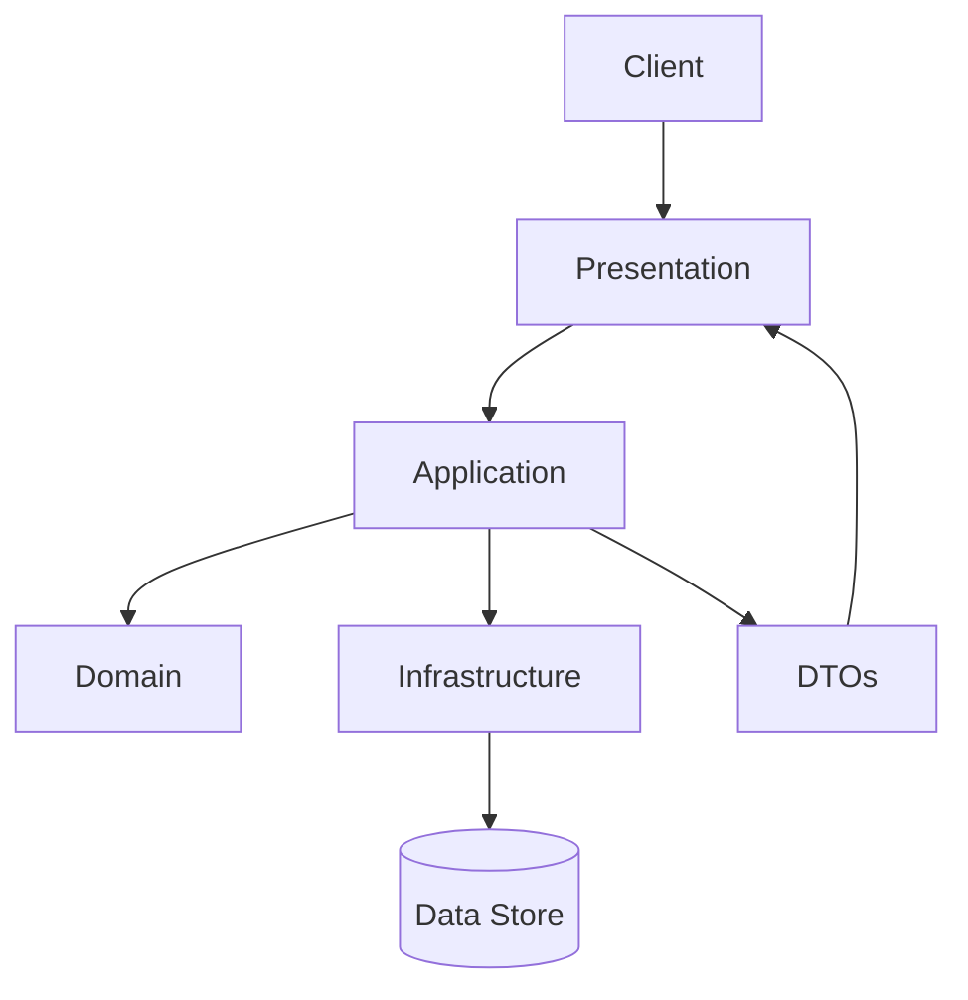

# Design Document

> **Linus 殘酷真言**：消除特殊情況、縮短資料流、拒絕華而不實的抽象。每個章節只寫必要事實，其他全部砍掉。

---

## Overview

### Feature Summary
[一句話描述此功能在系統中的職責與邊界]

### Design Philosophy
- **資料優先**：資料結構如何讓特殊情況自然消失？
- **相容性**：這個設計是否破壞任何既有 API / 資料？
- **實用主義**：為什麼這是最簡、最笨、卻最可靠的做法？

---

## Steering Document Alignment

### Technical Standards (tech.md)
- **語言 / 框架**： [依 tech.md 填寫，僅列真正用到的]
- **測試**： [主要測試框架、斷言庫、BDD/TDD 策略]
- **MVP 折衷**： [目前接受的限制，以及何時要還債]

### Project Structure (structure.md)
- 目錄映射：Domain → Application → Infrastructure → Presentation
- 依賴規則：外層依賴內層，Domain 不依賴任何人
- 若有偏離，寫下理由與補救方式

---

## Code Reuse Analysis

### Existing Components to Leverage
- **Domain**：`[Entity/ValueObject]` – [用途或擴充方式]
- **Services**：`[ServiceName]` – [如何整合]
- **Repositories / Gateways**：`[RepoName]` – [共用行為或需覆寫之處]
- **DTO / Utilities**：`[Name]` – [沿用或調整]

### Integration Points
- **APIs / Events**： [呼叫或訂閱哪些既有介面]
- **資料存儲**： [沿用哪張表 / DB / 檔案結構]

---

## Architecture

- **分層目的**：Presentation 處理 I/O，Application 協調流程，Domain 純業務，Infrastructure 實作介面
- **核心流程**：一句話說明資料如何在層間流動
- **不可打破的邊界**：列出禁止發生的依賴（例如：Domain 不可 import ORM）

---

## Domain Layer

### Entities / Value Objects
| 名稱 | 來源 (spec/erm.dbml) | 關鍵欄位 | 不變條件 |
|------|---------------------|----------|----------|
| `[Entity]` | `Table [Name]` | `[欄位列表]` | `[Invariants]` |

### Domain Services / Policies
- `[ServiceName]`： [一句話說明為何需要服務，輸入輸出是什麼]

### Domain Events (若有)
- `[EventName]`：觸發條件 / 責任方 / 訂閱者

---

## Application Layer

- **Use Cases**：列出公開的指令或查詢（Command / Query）
- **協調流程**：用 3~4 行敘述流程，Early Return 消除深層條件
- **跨切面關注**：驗證、交易、一致性如何處理

---

## Infrastructure & Integration

- **Repositories**：介面在 Domain，實作在此層，指出資料來源（DB / HTTP / File / Memory）
- **外部服務**：每個依賴寫清協議、錯誤行為、重試策略
- **Migration / Schema**：需要新增或修改哪些儲存結構

---

## Presentation / Interface

- **介面型式**：REST / GraphQL / CLI / Batch / Event
- **公開端點 / 指令**：URI 或命令，輸入輸出 DTO
- **驗證與錯誤映射**：如何把 Domain 例外轉為 HTTP/E2E 響應

---

## Error Handling & Observability

- **失敗分類**：使用者輸入錯誤、系統錯誤、外部依賴失敗
- **回應策略**：對應的 HTTP 狀態碼或錯誤碼
- **監控指標**：必要的 log / metrics / traces

---

## Testing Strategy

| 類型 | 目標 | 關鍵案例 |
|------|------|----------|
| BDD / Feature | 驗證端到端行為 | `[Scenario 名稱]` |
| Application Service 測試 | 驗證流程與協作 | `[Test Case]` |
| Domain 單元測試 | 驗證不變條件、狀態轉換 | `[Test Case]` |

---

## Linus Checklist

- [ ] 邊界條件由資料結構自然處理，而不是 if/else
- [ ] 任一函式 ≤ 20 行，縮排 ≤ 3 層
- [ ] Domain 不知道框架，Infrastructure 可被替換
- [ ] 任何改動都不破壞既有使用者
- [ ] 解決眼前真實問題，而不是虛構需求

---

## Trade-offs & Follow-ups

- **MVP 範圍**：目前接受的犧牲（效能 / 一致性 / 可用性）
- **未來路線**：何時需要重構或引入新元件
- **技術債指標**：明確描述一旦超出什麼門檻就必須處理
