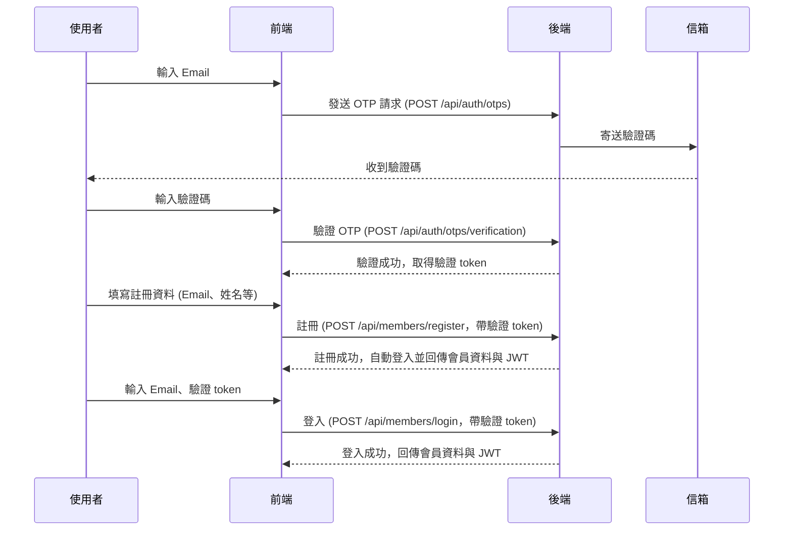

# 會員註冊與登入流程說明

> ⚠️ **目前 JWT 欄位為範例值，尚未串接實際 JWT 產生，未來將補上完整登入驗證機制。**

## 流程圖



---

## API 操作步驟

### 1. 發送 OTP 驗證碼
- **API**：`POST /api/auth/otps`
- **Body 範例**：
```json
{
  "email": "user@example.com"
}
```
- **說明**：輸入 email，系統會寄送驗證碼到信箱。

### 2. 驗證 OTP 驗證碼
- **API**：`POST /api/auth/otps/verification`
- **Body 範例**：
```json
{
  "email": "user@example.com",
  "otp": "123456"
}
```
- **說明**：輸入收到的驗證碼，驗證成功會取得驗證 token。

### 3. 註冊會員
- **API**：`POST /api/members/register`
- **Body 範例**：
```json
{
  "email": "user@example.com",
  "otpToken": "驗證成功取得的 token",
  "givenName": "小明",
  "familyName": "王",
  "nickName": "明明",
  "birthday": "2000-01-01"
}
```
- **說明**：填寫註冊資料，需帶上驗證 token。
- **回應**：
```json
{
  "email": "user@example.com",
  "jwt": "jwt-token"
}
```
- **說明**：註冊成功即自動登入，回傳 JWT。

### 4. 會員登入
- **API**：`POST /api/members/login`
- **Body 範例**：
```json
{
  "email": "user@example.com",
  "otpToken": "驗證成功取得的 token"
}
```
- **說明**：登入時必須同時帶入 email 與驗證 token，系統會再次驗證 OTP 是否通過。
- **回應**：
```json
{
  "email": "user@example.com",
  "jwt": "jwt-token"
}
```

---

## 其他補充

- **OTP 驗證碼**：每次驗證碼有效 10 分鐘，最多嘗試 3 次。
- **驗證 token**：驗證 OTP 成功後取得，註冊與登入皆需帶入。
- **錯誤處理**：API 會回傳友善訊息，請依照訊息提示操作。
- **測試用 API**：開發環境可用 `/api/auth/otps-test` 直接取得驗證碼。

---

## 常見問題

- 註冊後是否自動登入？
  - 是，註冊成功即回傳 JWT，前端可直接登入。
- 驗證 token 可以重複使用嗎？
  - 建議每次註冊/登入都重新驗證 OTP，token 有時效性。
- 忘記驗證碼怎麼辦？
  - 可重新發送 OTP，舊驗證碼會失效。

---

> 若有任何錯誤，API 會回傳友善的錯誤訊息，請依照訊息提示操作。
