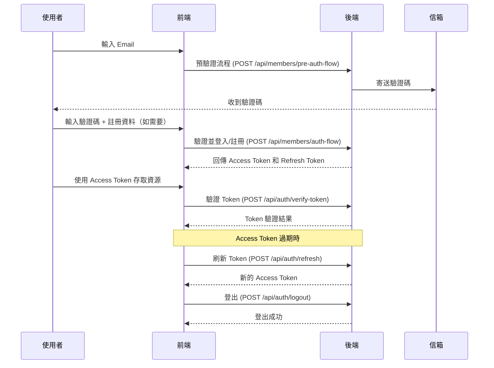

# 會員註冊與登入流程說明

## 流程圖



---

## API 操作步驟

### 1. 預驗證流程 - 判斷登入/註冊並發送 OTP
- **API**：`POST /api/members/pre-auth-flow`
- **Body 範例**：
```json
{
  "email": "user@example.com",
  "clientId": "web" // 選填,暫時保留欄位
}
```
- **說明**：系統會自動判斷該 email 是否已註冊，並發送對應的 OTP 驗證碼。
- **回應**：
```json
{
  "email": "user@example.com",
  "exists": false,
  "purpose": "REGISTRATION",
  "actionCode": "001"
}
```
- **說明**：
  - `exists`: 帳號是否已存在
  - `purpose`: 系統判定的用途（REGISTRATION 或 LOGIN）
  - `actionCode`: PRD action code（REGISTRATION=001, LOGIN=002）

### 2. 驗證 OTP 並完成登入/註冊
- **API**：`POST /api/members/auth-flow`
- **Body 範例**：
```json
{
  "email": "user@example.com",
  "otpCode": "123456",
  "clientId": "web", // 選填,暫時保留欄位
  "ip": "192.168.1.1",
  "ua": "Mozilla/5.0...",
  "givenName": "小明",
  "familyName": "王",
  "nickName": "明明",
  "birthday": "2000-01-01",
  "langType": "zh-TW"
}
```
- **說明**：
  - 驗證 OTP 驗證碼
  - 如果是新用戶（purpose=REGISTRATION），會自動註冊並登入
  - 如果是現有用戶（purpose=LOGIN），會直接登入
  - 註冊時可填寫 `givenName`、`familyName`、`nickName`、`birthday`、`langType` 等資料（`langType` 預設 zh-TW）
  - access_token cookie保留15分鐘，refresh_token cookie保留14天
- **回應**：
```json
{
  "id": "550e8400-e29b-41d4-a716-446655440000",
  "role": "001",
  "cookies": {
    "access_token": {
      "code": "eyJhbGciOiJIUzI1NiIsInR5cCI6IkpXVCJ9...",
      "time": 900
    },
    "refresh_token": {
      "code": "rt_eyJhbGciOiJIUzI1NiIsInR5cCI6IkpXVCJ9...",
      "time": 1209600
    }
  }
}
```
- **說明**：
  - `id`: 會員 ID
  - `role`: 身分代碼（001=MEMBER）
  - `cookies`: 要由 BFF 寫入 Cookie 的 token 資訊
    - `access_token`: JWT Token，有效期 1 小時
    - `refresh_token`: Refresh Token，有效期 30 天

- **錯誤範例（欄位驗證失敗）**：
```json
{
  "data": null,
  "meta": null,
  "error": {
    "code": "400106",
    "message": "會員資料欄位錯誤",
    "timestamp": "2024-01-15T10:30:00Z",
    "details": {
      "givenName": "given_name 長度不可超過30",
      "langType": "不支援的語系"
    }
  }
}
```

### 3. 驗證 Token
- **API**：`POST /api/auth/verify-token`
- **Body 範例**：
```json
{
  "tokenType": "ACCESS",
  "token": "eyJhbGciOiJIUzI1NiIsInR5cCI6IkpXVCJ9...",
  "clientId": "web" // 選填,暫時保留欄位
}
```
- **說明**：驗證 Access Token 或 Refresh Token 的有效性
- **回應**：
```json
{
  "valid": true,
  "tokenType": "ACCESS",
  "reason": null,
  "sub": "550e8400-e29b-41d4-a716-446655440000",
  "role": "001",
  "exp": 1703123456
}
```
- **說明**：
  - `valid`: Token 是否有效
  - `tokenType`: Token 類型（ACCESS 或 REFRESH）
  - `reason`: 無效原因（可為 null）
  - `sub`: Token 的 subject（會員 ID）
  - `role`: 身分代碼（ACCESS Token 才有）
  - `exp`: 過期時間（epoch second，ACCESS Token 才有）

### 4. 刷新 Access Token
- **API**：`POST /api/auth/refresh`
- **Body 範例**：
```json
{
  "refreshToken": "rt_eyJhbGciOiJIUzI1NiIsInR5cCI6IkpXVCJ9...",
  "clientId": "web", // 選填,暫時保留欄位
  "ip": "192.168.1.1",
  "ua": "Mozilla/5.0..."
}
```
- **說明**：當 Access Token 過期時，使用 Refresh Token 取得新的 Access Token。Refresh Token 會繼續沿用，不會產生新的 Refresh Token。
- **回應**：
```json
{
  "accessToken": "eyJhbGciOiJIUzI1NiIsInR5cCI6IkpXVCJ9...",
  "expiresIn": 900
}
```
- **說明**：
  - `accessToken`: 新的 Access Token (JWT)
  - `expiresIn`: Access Token 的有效期（秒數) ，cookie保留15分鐘
  

### 5. 登出
- **API**：`POST /api/auth/logout`
- **Body 範例**：
```json
{
  "refreshToken": "rt_eyJhbGciOiJIUzI1NiIsInR5cCI6IkpXVCJ9..."
}
```
- **說明**：使用 Refresh Token 進行登出，撤銷該用戶在相同平台（clientId）的所有 Refresh Token
- **回應**：
```json
{
  "ok": true
}
```

---

## 其他補充

- **OTP 驗證碼**：每次驗證碼有效 10 分鐘，最多嘗試 3 次。
- **Access Token**：JWT Token，有效期 1 小時，用於存取受保護的資源。
- **Refresh Token**：用於刷新 Access Token，有效期 30 天。
- **Token 刷新策略**：刷新時只產生新的 Access Token，Refresh Token 繼續沿用，不會進行 Token Rotation。
- **登出機制**：登出時會撤銷該用戶在相同平台的所有 Refresh Token，確保安全性。
- **錯誤處理**：API 會回傳友善訊息，請依照訊息提示操作。
- **測試用 API**：開發環境可用 `/api/auth/otps-test` 直接取得驗證碼。

---

## 常見問題

- 註冊後是否自動登入？
  - 是，註冊成功即回傳 Access Token 和 Refresh Token，前端可直接登入。
- Refresh Token 可以重複使用嗎？
  - 是的，Refresh Token 可以重複使用來刷新 Access Token，直到過期或被撤銷。
- 忘記驗證碼怎麼辦？
  - 可重新發送 OTP，舊驗證碼會失效。
- Access Token 過期怎麼辦？
  - 使用 Refresh Token 呼叫 `/api/auth/refresh` 取得新的 Access Token。
- 如何判斷用戶是登入還是註冊？
  - 呼叫 `/api/members/pre-auth-flow` 後，系統會回傳 `exists` 和 `purpose` 欄位。
- 刷新 Token 時會產生新的 Refresh Token 嗎？
  - 不會，只會產生新的 Access Token，Refresh Token 繼續沿用。

---

## Token 管理最佳實踐

1. **Access Token**：存放在記憶體中，用於 API 請求
2. **Refresh Token**：存放在 HttpOnly Cookie 中，確保安全性
3. **自動刷新**：在 Access Token 即將過期前自動刷新
4. **登出清理**：登出時清除所有相關的 token
5. **錯誤處理**：當 Refresh Token 無效時，重新導向到登入頁面

---

> 若有任何錯誤，API 會回傳友善的錯誤訊息，請依照訊息提示操作。
