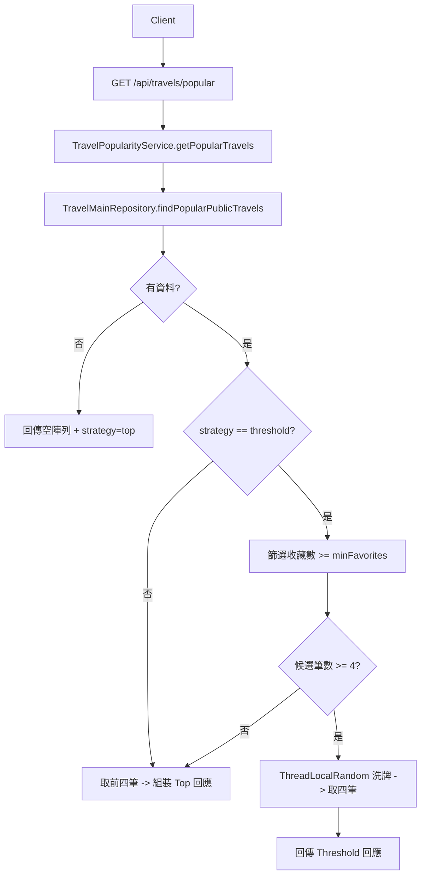

# Popular Travel API 文件

本文件說明 `TravelController` 新增的 GET 端點 `/api/travels/popular` 的用途、請求與回應格式，以及內部處理流程。文件格式比照 `travel-api.md`。

- **授權需求**：無，僅回傳公開 (`isPrivate = false`) 行程，匿名訪客即可呼叫。
- **回應格式**：統一使用 `RestResponse`，`data` 為行程清單，`meta` 帶回實際採用策略與候選數。
- **新增欄位**：回應內增加 `creator`（建立者名稱）、`locationName`（首個目的地名稱）、`imgUrl`（人氣行程顯示圖）。

---

## 取得人氣行程 `GET /api/travels/popular`
- **目的**：依 `travel_fav` 收藏數彙總後，回傳最多四筆公開人氣主行程。
- **策略**：透過 `strategy` 參數支援兩種模式：
  - `top`（預設）：依收藏數遞減、建立時間遞減排序，取前四筆。
  - `threshold`：設定 `minFavorites` 門檻，篩出符合門檻的行程後隨機挑四筆；若候選不足四筆則回退 `top` 邏輯補足。
- **請求參數**
  - `strategy` (query, optional)：`top` or `threshold`，預設 `top`。
  - `minFavorites` (query, optional)：僅在 `threshold` 時使用，預設 5，需為 0 以上整數。

### 請求範例
```http
GET /api/travels/popular?strategy=threshold&minFavorites=8 HTTP/1.1
Host: example.com
Accept-Language: zh-TW
```

### 成功回應 (Top 模式)
```json
{
  "data": [
    {
      "travelMainId": "4f401a63-1f38-4fb4-a951-cbd3d8de4b0f",
      "title": "東京五日遊",
      "startDate": "2024-09-01",
      "endDate": "2024-09-05",
      "visitPlace": "[{\"code\":\"JP\"}]",
      "favoritesCount": 18,
      "isPrivate": false,
      "creator": "王小明",
      "locationName": "日本",
      "imgUrl": "/assets/images/popular-travel-default.png"
    },
    {
      "travelMainId": "c076c6c1-b9f3-4c41-8de4-492a961ac678",
      "title": "大阪親子行",
      "startDate": "2024-08-15",
      "endDate": "2024-08-19",
      "visitPlace": "[{\"code\":\"JP\"}]",
      "favoritesCount": 15,
      "isPrivate": false,
      "creator": "王小明",
      "locationName": "日本",
      "imgUrl": "/assets/images/popular-travel-default.png"
    }
  ],
  "meta": {
    "strategy": "top",
    "minFavorites": null,
    "totalCandidates": 12
  },
  "error": null
}
```

### 成功回應 (Threshold 模式，候選 ≥ 4)
```json
{
  "data": [
    {
      "travelMainId": "f7d3aab5-9af2-4f32-a4a3-9d9c98f0643e",
      "title": "首爾美食攻略",
      "startDate": "2024-10-10",
      "endDate": "2024-10-13",
      "visitPlace": "[{\"code\":\"KR\"}]",
      "favoritesCount": 11,
      "isPrivate": false,
      "creator": "李小花",
      "locationName": "韓國",
      "imgUrl": "/assets/images/popular-travel-default.png"
    },
    {
      "travelMainId": "7c5182c1-ae9e-4f82-b1a7-52dd4a33f9f2",
      "title": "北海道滑雪趣",
      "startDate": "2024-12-20",
      "endDate": "2024-12-24",
      "visitPlace": "[{\"code\":\"JP\"}]",
      "favoritesCount": 10,
      "isPrivate": false,
      "creator": "王小明",
      "locationName": "日本",
      "imgUrl": "/assets/images/popular-travel-default.png"
    },
    {
      "travelMainId": "b05fb706-8d9a-41a9-9ab9-9adacbe1b1a6",
      "title": "曼谷親子樂",
      "startDate": "2024-07-05",
      "endDate": "2024-07-09",
      "visitPlace": "[{\"code\":\"TH\"}]",
      "favoritesCount": 9,
      "isPrivate": false,
      "creator": "陳小美",
      "locationName": "泰國",
      "imgUrl": "/assets/images/popular-travel-default.png"
    },
    {
      "travelMainId": "3a4e0e3e-8bb5-4f0e-9ad4-49c7ce840c44",
      "title": "巴黎深度自由行",
      "startDate": "2024-05-01",
      "endDate": "2024-05-06",
      "visitPlace": "{\"country\":\"FR\"}",
      "favoritesCount": 8,
      "isPrivate": false,
      "creator": "Jean Dupont",
      "locationName": "法國",
      "imgUrl": "/assets/images/popular-travel-default.png"
    }
  ],
  "meta": {
    "strategy": "threshold",
    "minFavorites": 8,
    "totalCandidates": 7
  },
  "error": null
}
```

> 若 `threshold` 模式候選不足四筆，`meta.strategy` 會改為 `top`，並依收藏數排序取前四筆。

### 失敗回應
- **不支援的 strategy**：
```json
{
  "data": null,
  "meta": null,
  "error": {
    "code": "POPULAR_STRATEGY_INVALID",
    "message": "Unsupported popular strategy: foo",
    "timestamp": "2024-09-01T08:00:00Z",
    "details": ["foo"]
  }
}
```
- **minFavorites 小於 0**：回傳 `POPULAR_MIN_FAVORITES_INVALID`。

### 處理流程


### 實作重點
1. 透過 `TravelMainRepository.findPopularPublicTravels()` 進行收藏數聚合，僅包含 `isPrivate = false` 的主行程，結果依收藏數 DESC、建立時間 DESC 排序。
2. `TravelPopularityService` 會：
   - 將 `strategy` 字串轉換成列舉並驗證，無效值丟出 `POPULAR_STRATEGY_INVALID`。
   - `threshold` 模式下解析 `minFavorites`（預設 5，禁止負值），篩選符合門檻的行程，並以 `Collections.shuffle` 配合 `ThreadLocalRandom` 隨機選取四筆。
   - 當候選不足四筆時回退 `top` 模式，以確保永遠有最多四筆資料可用。
   - 依 `travel_main_id` 查詢 `member` 資料，組合 `creator`，並解析 `visit_place` 取得首個 `code` 後批次查詢 `locationName`。
   - `imgUrl` 先回傳預設的顯示圖路徑。
3. Controller 透過 `RestResponseUtils.successWithMeta(...)` 將行程陣列與 `PopularTravelMeta` 一併回傳。

---