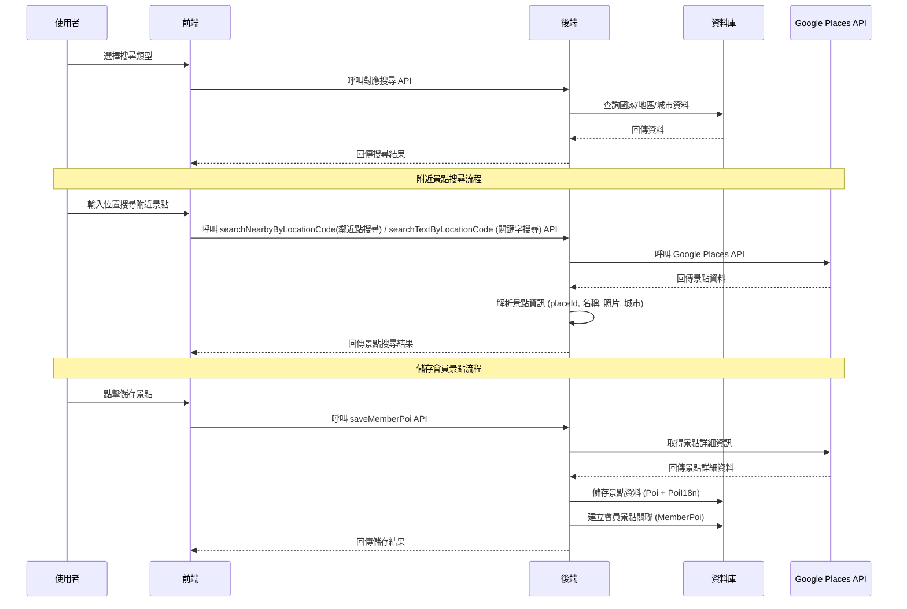

# 搜尋引擎 API 說明

> 提供國家、地區、城市搜尋功能，以及 Google Places API 整合的附近景點搜尋。

> 所有搜尋相關 API 需透過 `Accept-Language` 指定語系（支援 `zh-TW`、`en-US`，預設為 `zh-TW`）。

## 流程圖



## API 端點總覽

| 方法   | 端點                                      | 說明                     |
|--------|-------------------------------------------|--------------------------|
| GET    | `/api/search/countries`                   | 取得所有國家列表         |
| POST   | `/api/search/regions`                     | 取得指定國家的地區和城市 |
| GET    | `/api/search/allLocations`                | 取得所有地點資料         |
| POST   | `/api/search/searchNearby`                | 搜尋附近景點             |
| POST   | `/api/search/searchNearbyByLocationCode`  | 根據 Location 代碼搜尋附近景點 |
| POST   | `/api/search/searchTextByLocationCode`    | 根據 Location 代碼和文字查詢搜尋景點 |
| GET    | `/api/search/settings/{category}`         | 根據類別查詢設定         |
| GET    | `/api/search/settings/language-types`     | 查詢所有語言類型設定     |
| GET    | `/api/search/placeDetails`                | 取得地點詳細資訊 (含照片) |
| POST   | `/api/search/memberPois`                  | 取得會員收藏景點清單 ⭐ |
| POST   | `/api/search/saveMemberPoi`               | 儲存會員景點 ⭐          |

## API 詳細說明

### 1. 取得國家列表

- **API**: `GET /api/search/countries`
- **描述**: 取得所有國家列表
- **請求參數**:
  - **標頭**:
    | 標頭              | 型別   | 必填 | 說明                    |
    |-------------------|--------|------|-------------------------|
| `Accept-Language` | String | 否   | 語言類型 (如：zh-TW, en-US) |
- **回應**: List<國家>
- **回應範例**:
  ```json
  [
    {
      "code": "TW",
      "name": "台灣"
    },
    {
      "code": "JP",
      "name": "日本"
    }
  ]
  ```

### 2. 取得地區和城市

- **API**: `POST /api/search/regions`
- **描述**: 取得指定國家的地區和城市
- **請求參數**:
  - **標頭**:
    | 標頭              | 型別   | 必填 | 說明                    |
    |-------------------|--------|------|-------------------------|
| `Accept-Language` | String | 否   | 語言類型 (如：zh-TW, en-US) |
  - **請求體**:
    | 參數         | 型別   | 必填 | 說明              |
    |--------------|--------|------|-------------------|
    | `code`       | String | 是   | 國家代碼          |
  - **請求體範例**:
    ```json
    {
      "code": "TW"
    }
    ```
- **回應**: List<地區>
- **回應範例**:
  ```json
  [
    {
      "regionCode": "TW-N",
      "regionName": "北部",
      "orderIndex": 1,
      "cities": [
        {
          "code": "TPE",
          "name": "台北市"
        },
        {
          "code": "TPQ",
          "name": "新北市"
        }
      ]
    }
  ]
  ```

### 3. 取得所有地點

- **API**: `GET /api/search/allLocations`
- **描述**: 取得所有地點資料
- **請求參數**: 無
- **回應**: List<地點>
- **回應範例**:
  ```json
  [
    {
      "code": "TPE",
      "name": "台北市",
      "langType": "zh-TW"
    },
    {
      "code": "TPE",
      "name": "Taipei",
      "langType": "en-US"
    }
  ]
  ```

### 4. 搜尋附近景點

- **API**: `POST /api/search/searchNearby`
- **描述**: 搜尋附近景點
- **請求參數**: NearbySearchRequest
- **回應**: List<LocationSearch>

### 5. 根據 Location 代碼搜尋附近景點 ⭐

- **API**: `POST /api/search/searchNearbyByLocationCode`
- **描述**: 使用 Location 代碼自動取得經緯度，然後搜尋附近景點
- **請求參數**:
  - **標頭**:
    | 標頭              | 型別   | 必填 | 說明                    |
    |-------------------|--------|------|-------------------------|
| `Accept-Language` | String | 否   | 語言類型 (如：zh-TW, en-US) |
  - **請求體**:
    | 參數            | 型別         | 必填 | 說明                           |
    |-----------------|--------------|------|--------------------------------|
    | `code`          | String       | 是   | Location 代碼                  |
  - **請求體範例**:
    ```json
    {
      "code": "TPE"
    }
    ```
- **回應**: List<LocationSearch>
- **回應範例**:
  ```json
  [
    {
      "placeId": "ChIJN1t_tDeuEmsRUsoyG83frY4",
      "name": "Google Sydney",
      "city": "Sydney",
      "rating": 4.5,
      "photoUrl": "https://..."
    }
  ]
  ```

### 6. 根據 Location 代碼和文字查詢搜尋景點 ⭐

- **API**: `POST /api/search/searchTextByLocationCode`
- **描述**: 結合文字搜尋和位置偏向，在指定區域內搜尋特定景點
- **請求參數**:
  - **標頭**:
    | 標頭              | 型別   | 必填 | 說明                    |
    |-------------------|--------|------|-------------------------|
| `Accept-Language` | String | 否   | 語言類型 (如：zh-TW, en-US) |
  - **請求體**: TextSearchRequest
- **回應**: List<LocationSearch>
- **回應範例**:
  ```json
  [
    {
      "placeId": "ChIJi73bYWusQjQRG_mf-jDN2-8",
      "name": "台北101",
      "city": "台北市",
      "rating": 4.4,
      "photoUrl": "https://..."
    }
  ]
  ```

### 7. 根據類別查詢設定 ⭐

- **API**: `GET /api/search/settings/{category}`
- **描述**: 根據類別查詢設定，支援 `POI_TYPE`、`LANG_TYPE`
- **請求參數**:
  - **標頭**:
    | 標頭              | 型別   | 必填 | 說明                    |
    |-------------------|--------|------|-------------------------|
    | `Accept-Language` | String | 否   | 語言類型 (預設 zh-TW)   |
  - **路徑參數**:
    | 參數      | 型別   | 必填 | 說明              |
    |-----------|--------|------|-------------------|
    | `category`| String | 是   | 設定類別          |
- **回應**: List<Setting>
- **回應範例**:
  ```json
  [
    {
      "category": "POI_TYPE",
      "codeName": "P001",
      "codeDesc": "FOOD_DRINK",
      "name": "Restaurants",
      "description": "Food & Drink"
    }
  ]
  ```

### 8. 查詢所有語言類型設定 ⭐

- **API**: `GET /api/search/settings/language-types`
- **描述**: 專門用於查詢語言類型設定的快捷端點
- **請求參數**:
  - **標頭**:
    | 標頭              | 型別   | 必填 | 說明                    |
    |-------------------|--------|------|-------------------------|
    | `Accept-Language` | String | 否   | 語言類型 (預設 zh-TW)   |
- **回應**: List<Setting>
- **回應範例**:
  ```json
  [
    {
      "category": "LANG_TYPE",
      "codeName": "zh-TW",
      "codeDesc": "ZH_TW",
      "name": "繁體中文（台灣）",
      "description": "介面語言：繁體中文（台灣）"
    }
  ]
  ```

### 9. 取得地點詳細資訊 (含照片)

- **API**: `GET /api/search/placeDetails`
- **描述**: 根據 Google PlaceId 取得該地點的詳細資訊
- **請求參數**:
  - **標頭**:
    | 標頭              | 型別   | 必填 | 說明                    |
    |-------------------|--------|------|-------------------------|
| `Accept-Language` | String | 否   | 語言類型 (如：zh-TW, en-US) |
  - **查詢參數**:
    | 參數      | 型別   | 必填 | 說明                        |
    |-----------|--------|------|-----------------------------|
    | `placeId` | String | 是   | Google Place 的唯一識別碼   |
- **回應**: 地點詳細資訊
- **回應範例**:
  ```json
  {
    "id": "ChIJN1t_tDeuEmsRUsoyG83frY4",
    "name": "Google Sydney",
    "addr": "48 Pirrama Rd, Pyrmont NSW 2009, Australia",
    "rate": 4.5,
    "cnt": 1000,
    "desc": "Google's Sydney office.",
    "tel": "+61 2 9374 4000",
    "site": "https://www.google.com.au/about/careers/locations/sydney/",
    "lat": -33.866651,
    "lon": 151.195827,
    "city": "Sydney",
    "country": "Australia",
    "photos": [
      "https://places.googleapis.com/v1/xxx/media?key=xxx&maxWidthPx=400"
    ],
    "rawHours": {
      "weekdayDescriptions": [
        "Monday: 9:00 AM – 5:00 PM",
        "Tuesday: 9:00 AM – 5:00 PM"
      ]
    }
  }
  ```

### 10. 儲存會員景點 ⭐

- **API**: `POST /api/search/saveMemberPoi`
- **描述**: 儲存會員指定的景點到個人收藏，支援多語系資料儲存
- **認證**: 需要 Bearer Token 驗證（透過 Authorization header）
- **請求參數**:
  - **標頭**:
    | 標頭              | 型別   | 必填 | 說明                    |
    |-------------------|--------|------|-------------------------|
    | `Authorization`   | String | 否   | Bearer Token 格式      |
| `Accept-Language` | String | 否   | 語言類型 (如：zh-TW, en-US) |
  - **請求體**:
    | 參數      | 型別   | 必填 | 說明                        |
    |-----------|--------|------|-----------------------------|
    | `memberId`| UUID   | 否   | 會員 ID (方便測試API用)      |
    | `placeId` | String | 是   | Google Place 的唯一識別碼   |
    | `langType`| String | 是   | 語言類型                   |
  - **請求體範例**:
    ```json
    {
      "memberId": "550e8400-e29b-41d4-a716-446655440000",
      "placeId": "ChIJN1t_tDeuEmsRUsoyG83frY4",
      "langType": "zh-TW"
    }
    ```
- **認證流程**:
  1. 系統會從 `Authorization` header 中提取 Bearer Token
  2. 驗證 Token 的有效性
  3. 從 Token 的 `sub` 欄位取得會員 ID
  4. 如果 Token 無效或過期，會回傳 401 未授權錯誤
- **回應**: SaveMemberPoiResponse
- **回應範例**:
  ```json
  {
    "code": 1,
    "desc": "OK",
    "poiId": "550e8400-e29b-41d4-a716-446655440001",
    "poiCreated": true,
    "langInserted": true,
    "alreadySaved": false
  }
  ```
- **常見錯誤**:
  | 錯誤代碼                    | 說明                 | 解決方法                  |
  |-----------------------------|----------------------|---------------------------|
  | `401 Unauthorized`          | Token 無效或過期     | 重新登入取得有效 Token    |
  | `unsupported langType`      | 不支援的語言類型     | 檢查 `langType` 是否正確  |
  | `place not found`           | 找不到指定景點       | 確認 `placeId` 是否有效   |
  | `place missing required fields` | 景點缺少必要欄位 | 選擇其他景點              |

### 11. 取得會員收藏景點清單 ⭐

- **API**: `POST /api/search/memberPois`
- **描述**: 取得會員依指定類型的收藏景點，並回傳分頁資訊。
- **認證**: 需要 Bearer Token 驗證
- **請求參數**:
  - **標頭**:
    | 標頭            | 型別   | 必填 | 說明                    |
    |-----------------|--------|------|-------------------------|
    | `Authorization` | String | 是   | Bearer Token 格式       |
    | `Accept-Language` | String | 否 | 語言類型 (如：zh-TW, en-US) |
  - **請求體**:
    | 參數            | 型別   | 必填 | 說明                              |
    |-----------------|--------|------|-----------------------------------|
    | `poiType`       | String | 是   | 景點類型代碼 (P001–P018)          |
    | `page`          | Integer| 否   | 頁碼，預設 1                      |
    | `maxResultCount`| Integer| 否   | 每頁筆數，預設 5，範圍 5–20       |
  - **請求體範例**:
    ```json
    {
      "poiType": "P001",
      "page": 1,
      "maxResultCount": 5
    }
    ```
- **回應**: `MemberPoiListResponse`
- **回應範例**:
    ```json
    {
      "list": [
        {
          "placeId": "ChIJNw3g1QZePjURMSN68fjJ92o",
          "name": "Yozan Museum",
          "city": "Kagoshima",
          "photoUrl": "https://.../media?key=API_KEY&maxWidthPx=400",
          "rating": 2.8
        }
      ],
      "meta": {
        "page": 1,
        "size": 5,
        "totalPages": 3,
        "totalElements": 13,
        "hasNext": true,
        "hasPrev": false
      }
    }
    ```
- **常見錯誤**:
  | 錯誤代碼                  | 說明                 |
  |---------------------------|----------------------|
  | `invalid poi type`        | poiType 不在允許範圍 |
  | `invalid max result count`| 每頁筆數不在範圍內   |
  | `invalid page`            | page 必須 >= 1       |

## 共同資料結構

### 國家

| 欄位   | 型別   | 說明      |
|--------|--------|-----------|
| `code` | String | 國家代碼  |
| `name` | String | 國家名稱  |

### 地區

| 欄位        | 型別         | 說明      |
|-------------|--------------|-----------|
| `regionCode`| String       | 地區代碼  |
| `regionName`| String       | 地區名稱  |
| `orderIndex`| Integer      | 排序索引  |
| `cities`    | List<城市>   | 城市列表  |

### 城市

| 欄位   | 型別   | 說明      |
|--------|--------|-----------|
| `code` | String | 城市代碼  |
| `name` | String | 城市名稱  |

### 地點

| 欄位      | 型別   | 說明      |
|-----------|--------|-----------|
| `code`    | String | 地點代碼  |
| `name`    | String | 地點名稱  |
| `langType`| String | 語言類型  |

### 搜尋結果 (LocationSearch)

| 欄位      | 型別   | 說明                  |
|-----------|--------|-----------------------|
| `placeId` | String | Google Places 唯一識別碼 |
| `name`    | String | 景點名稱              |
| `city`    | String | 所在城市              |
| `rating`  | Double | 評分                  |
| `photoUrl`| String | 景點照片網址          |

### 設定 (Setting)

| 欄位      | 型別   | 說明      |
|-----------|--------|-----------|
| `category`| String | 設定類別  |
| `name`    | String | 設定名稱  |
| `codeName`| String | 設定代碼  |
| `codeDesc`| String | 設定描述  |

### 儲存會員景點回應 (SaveMemberPoiResponse)

| 欄位         | 型別    | 說明                        |
|--------------|---------|-----------------------------|
| `code`       | Integer | 回應代碼 (1=成功, 0=失敗)  |
| `desc`       | String  | 回應描述                   |
| `poiId`      | UUID    | 景點 ID                    |
| `poiCreated` | Boolean | 是否新建立景點記錄         |
| `langInserted`| Boolean| 是否新建立語系記錄         |
| `alreadySaved`| Boolean| 會員是否已收藏過此景點     |

## 景點類型

以下是常用的景點類型，可用於 `includedTypes` 參數：

| 類型               | 說明      |
|--------------------|-----------|
| `restaurant`       | 餐廳      |
| `tourist_attraction`| 觀光景點 |
| `hotel`            | 飯店      |
| `shopping_mall`    | 購物中心  |
| `museum`           | 博物館    |
| `park`             | 公園      |
| `cafe`             | 咖啡廳    |
| `bar`              | 酒吧      |

## 使用範例

### 前端 JavaScript 範例

```javascript
// 1. 取得國家列表
const countries = await fetch('/api/search/countries', {
  headers: { 'Accept-Language': 'zh-TW' }
}).then(res => res.json());

// 2. 取得地區和城市
const regions = await fetch('/api/search/regions', {
  method: 'POST',
  headers: { 
    'Content-Type': 'application/json',
    'Accept-Language': 'zh-TW'
  },
  body: JSON.stringify({
    code: 'TW'
  })
}).then(res => res.json());

// 3. 根據 Location 代碼搜尋附近景點
const nearbyByCode = await fetch('/api/search/searchNearbyByLocationCode', {
  method: 'POST',
  headers: { 
    'Content-Type': 'application/json',
    'Accept-Language': 'zh-TW'
  },
  body: JSON.stringify({
    code: 'TPE'
  })
}).then(res => res.json());

// 4. 根據 Location 代碼和文字查詢搜尋景點
const textSearch = await fetch('/api/search/searchTextByLocationCode', {
  method: 'POST',
  headers: { 
    'Content-Type': 'application/json',
    'Accept-Language': 'zh-TW'
  },
  body: JSON.stringify({
    textQuery: '台北101',
    code: 'TPE'
  })
}).then(res => res.json());

// 5. 查詢語言類型設定
const languageTypes = await fetch('/api/search/settings/LANG_TYPE', {
  headers: { 'Accept-Language': 'en-US' }
}).then(res => res.json());

// 6. 查詢所有語言類型設定
const allLanguageTypes = await fetch('/api/search/settings/language-types', {
  headers: { 'Accept-Language': 'en-US' }
}).then(res => res.json());

// 7. 取得地點詳細資訊
const placeDetails = await fetch('/api/search/placeDetails?placeId=ChIJN1t_tDeuEmsRUsoyG83frY4', {
  headers: { 'Accept-Language': 'zh-TW' }
}).then(res => res.json());

// 8. 儲存會員景點
const saveResult = await fetch('/api/search/saveMemberPoi', {
  method: 'POST',
  headers: { 
    'Content-Type': 'application/json',
    'Authorization': 'Bearer ' + accessToken, // 需要有效的 Bearer Token
    'Accept-Language': 'zh-TW'
  },
  body: JSON.stringify({
    memberId: '550e8400-e29b-41d4-a716-446655440000',
    placeId: 'ChIJN1t_tDeuEmsRUsoyG83frY4',
    langType: 'zh-TW'
  })
}).then(res => res.json());

console.log('儲存結果:', saveResult);
```

## 錯誤處理

API 會回傳標準 HTTP 狀態碼：
- `200`：成功
- `400`：請求參數錯誤
- `500`：伺服器內部錯誤

**錯誤回應範例**:
```json
{
  "error": "Invalid location coordinates",
  "message": "緯度或經度參數無效"
}
```

## 注意事項

1. **設定查詢限制**: 目前設定查詢只支援 `LANG_TYPE` 類別
2. **搜尋結果限制**: `maxResultCount` 參數限制在 5-20 之間
3. **排序偏好**: `rankPreference` 只支援特定值 (如 `RELEVANCE`, `DISTANCE`)
4. **Google Places API**: 需要有效的 Google API Key
5. **效能考量**:
   - 建議設定適當的 `maxResultCount`
   - 搜尋半徑不宜過大
   - 可快取常用搜尋結果
6. **資料來源**:
   - 國家/地區/城市資料來自本地資料庫
   - 附近景點資料來自 Google Places API
7. **會員景點儲存**:
   - 需要有效的 Bearer Token（透過 Authorization header）
   - 系統會自動從 Token 中提取會員 ID
   - 支援重複儲存檢查
   - 如果 Token 無效會回傳 401 錯誤