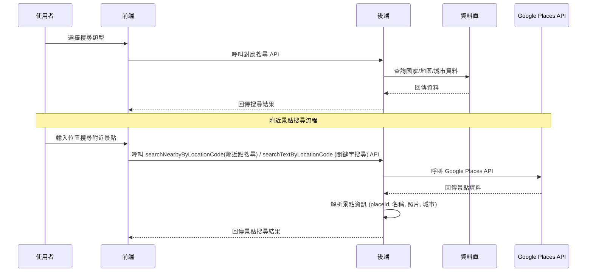

# 搜尋引擎 API 說明

> 提供國家、地區、城市搜尋功能，以及 Google Places API 整合的附近景點搜尋。

## 流程圖



---

## API 端點總覽

| 方法 | 端點 | 說明 |
|------|------|------|
| GET | `/api/search/countries/{langType}` | 取得所有國家列表 |
| POST | `/api/search/regions` | 取得指定國家的地區和城市 |
| GET | `/api/search/allLocations` | 取得所有地點資料 |
| POST | `/api/search/searchNearbyByLocationCode` | 根據 Location 代碼搜尋附近景點 |
| POST | `/api/search/searchTextByLocationCode` | 根據 Location 代碼和文字查詢搜尋景點 |

---

## API 詳細說明

### 1. 取得國家列表
- **API**：`GET /api/search/countries/{langType}`
- **參數**：
  - `langType` (path)：語言類型 (如：zh-TW, en-US)
- **回應範例**：
```json
[
  {
    "code": "TW",
    "name": "台灣"
  },
  {
    "code": "JP", 
    "name": "日本"
  }
]
```

### 2. 取得地區和城市
- **API**：`POST /api/search/regions`
- **Body 範例**：
```json
{
  "countryCode": "TW",
  "langType": "zh-TW"
}
```
- **回應範例**：
```json
[
  {
    "regionCode": "TW-N",
    "regionName": "北部",
    "orderIndex": 1,
    "cities": [
      {
        "code": "TPE",
        "name": "台北市"
      },
      {
        "code": "TPQ",
        "name": "新北市"
      }
    ]
  }
]
```

### 3. 取得所有地點
- **API**：`GET /api/search/allLocations`
- **回應範例**：
```json
[
  {
    "code": "TPE",
    "name": "台北市",
    "langType": "zh-TW"
  },
  {
    "code": "TPE",
    "name": "Taipei",
    "langType": "en-US"
  }
]
```

### 4. 根據 Location 代碼搜尋附近景點 ⭐
- **API**：`POST /api/search/searchNearbyByLocationCode`
- **Body 範例**：
```json
{
  "code": "TPE",
  "langType": "zh-TW",
  "includedTypes": ["restaurant", "hotel", "tourist_attraction"],
  "maxResultCount": 10, // 可選
  "rankPreference": "DISTANCE" // 可選
}
```
- **說明**：使用 Location 代碼自動取得經緯度，然後搜尋附近景點
- **回應格式**：與搜尋附近景點相同

### 5. 根據 Location 代碼和文字查詢搜尋景點 ⭐
- **API**：`POST /api/search/searchTextByLocationCode`
- **Body 範例**：
```json
{
  "textQuery": "台北101",
  "code": "TPE",
  "langType": "zh-TW",
  "maxResultCount": 10,
  "rankPreference": "RELEVANCE", // 可選
  "includedTypes": ["tourist_attraction"] // 可選
}
```
- **說明**：結合文字搜尋和位置偏向，在指定區域內搜尋特定景點
- **回應格式**：與搜尋附近景點相同

---

## 附近景點搜尋參數說明

### NearbySearchRequest 參數

| 參數 | 型別 | 必填 | 說明 |
|------|------|------|------|
| `locationRestriction.circle.center.latitude` | Double | ✓ | 搜尋中心點緯度 |
| `locationRestriction.circle.center.longitude` | Double | ✓ | 搜尋中心點經度 |
| `locationRestriction.circle.radius` | Double | ✓ | 搜尋半徑 (公尺) |
| `rankPreference` | String | | 排序方式 (DISTANCE, RATING) |
| `maxResultCount` | Integer | | 最大結果數量 (限制 5-20，預設 5) |
| `includedTypes` | List<String> | | 景點類型篩選 |

### SearchRequest 參數

| 參數 | 型別 | 必填 | 說明 |
|------|------|------|------|
| `code` | String | ✓ | Location 代碼 |
| `langType` | String | ✓ | 語言類型 |
| `includedTypes` | List<String> | | 景點類型篩選 |
| `maxResultCount` | Integer | | 最大結果數量 (限制 5-20，預設 5) |
| `rankPreference` | String | | 排序方式 (RELEVANCE, DISTANCE，預設 DISTANCE) |

### TextSearchRequest 參數

| 參數 | 型別 | 必填 | 說明 |
|------|------|------|------|
| `textQuery` | String | ✓ | 要搜尋的文字查詢 |
| `code` | String | ✓ | Location 代碼 |
| `langType` | String | ✓ | 語言類型 |
| `maxResultCount` | Integer | | 最大結果數量 (預設 5) |
| `rankPreference` | String | | 排序方式 (RELEVANCE, DISTANCE) |
| `includedTypes` | List<String> | | 景點類型篩選 |

### 常用景點類型 (includedTypes)

| 類型 | 說明 |
|------|------|
| `restaurant` | 餐廳 |
| `tourist_attraction` | 觀光景點 |
| `hotel` | 飯店 |
| `shopping_mall` | 購物中心 |
| `museum` | 博物館 |
| `park` | 公園 |
| `cafe` | 咖啡廳 |
| `bar` | 酒吧 |

---

## 回應欄位說明

### LocationSearch 回應欄位

| 欄位 | 型別 | 說明 |
|------|------|------|
| `placeId` | String | Google Places 唯一識別碼 |
| `name` | String | 景點名稱 |
| `city` | String | 所在城市 |
| `rating` | Long | 評分 (-1 表示無評分) |
| `photoUrl` | String | 景點照片完整網址 |

---

## 使用範例

### 前端 JavaScript 範例

```javascript
// 1. 取得國家列表
const countries = await fetch('/api/search/countries/zh-TW')
  .then(res => res.json());

// 2. 取得地區和城市
const regions = await fetch('/api/search/regions', {
  method: 'POST',
  headers: { 'Content-Type': 'application/json' },
  body: JSON.stringify({
    countryCode: 'TW',
    langType: 'zh-TW'
  })
}).then(res => res.json());

// 3. 根據 Location 代碼搜尋附近景點
const nearbyByCode = await fetch('/api/search/searchNearbyByLocationCode', {
  method: 'POST',
  headers: { 'Content-Type': 'application/json' },
  body: JSON.stringify({
    code: 'TPE',
    langType: 'zh-TW',
    includedTypes: ['restaurant', 'tourist_attraction'],
    maxResultCount: 10,
    rankPreference: 'DISTANCE'
  })
}).then(res => res.json());

// 4. 根據 Location 代碼和文字查詢搜尋景點
const textSearch = await fetch('/api/search/searchTextByLocationCode', {
  method: 'POST',
  headers: { 'Content-Type': 'application/json' },
  body: JSON.stringify({
    textQuery: '台北101',
    code: 'TPE',
    langType: 'zh-TW',
    maxResultCount: 10,
    rankPreference: 'RELEVANCE',
    includedTypes: ['tourist_attraction']
  })
}).then(res => res.json());
```

---

## 錯誤處理

API 會回傳標準 HTTP 狀態碼：

- `200`：成功
- `400`：請求參數錯誤
- `500`：伺服器內部錯誤

錯誤回應範例：
```json
{
  "error": "Invalid location coordinates",
  "message": "緯度或經度參數無效"
}
```

---

## 注意事項

1. **Google Places API 限制**：
   - 需要有效的 Google API Key
   - 有每日請求限制
   - 照片 URL 有時效性

2. **效能考量**：
   - 建議設定適當的 `maxResultCount`
   - 搜尋半徑不宜過大
   - 可快取常用搜尋結果

3. **資料來源**：
   - 國家/地區/城市資料來自本地資料庫
   - 附近景點資料來自 Google Places API

4. **搜尋方式差異**：
   - `searchNearby`：嚴格限制在指定區域內
   - `searchText`：使用位置偏向，結果可能超出指定區域但會優先顯示區域內結果

---

> 如有任何問題，請參考 API 回應的錯誤訊息進行除錯。