# Travel & Trans API 文件

以下文件依 `TravelController` 與 `TransController` 的所有 POST API 進行說明，內容包括用途說明、請求範例、成功與失敗回應範例，以及邏輯流程圖。

所有需授權的端點必須在 Header 帶入 `Authorization: Bearer <token>`，後端會透過 `AuthContext.getCurrentMemberId()` 取得會員 ID，前端不需傳送 `memberId` 或 `createdBy`。
---

## TravelController (`/api/travels`)

### 1. 建立主行程 `POST /createTravelMain`
- **目的**：建立新的旅遊主行程並自動產生對應的每日行程 `TravelDate`。
- **授權**：需要帶入 `Authorization: Bearer <token>`
- **請求範例**
```json
{
  "isPrivate": false,
  "startDate": "2024-09-01",
  "endDate": "2024-09-05",
  "title": "東京五日遊",
  "notes": "備註內容",
  "visitPlace": "{\"country\":\"JP\"}"
}
```
- **成功回應**
```json
{
  "data": {
    "id": "30c29c31-e9c2-4d0a-81d2-4f2a07123456",
    "memberId": "a3d2e7b4-1234-4321-9abc-5678def01234",
    "isPrivate": false,
    "startDate": "2024-09-01",
    "endDate": "2024-09-05",
    "title": "東京五日遊",
    "notes": "備註內容",
    "visitPlace": "{\"country\":\"JP\"}",
    "createdAt": "2024-06-01T08:00:00Z",
    "generatedTravelDates": [
      { "id": "...", "travelMainId": "...", "travelDate": "2024-09-01" },
      { "id": "...", "travelMainId": "...", "travelDate": "2024-09-02" },
      { "id": "...", "travelMainId": "...", "travelDate": "2024-09-03" },
      { "id": "...", "travelMainId": "...", "travelDate": "2024-09-04" },
      { "id": "...", "travelMainId": "...", "travelDate": "2024-09-05" }
    ]
  },
  "meta": null,
  "error": null
}
```
- **失敗回應 (範例：TRAVEL_MEMBER_NOT_FOUND)**
```json
{
  "data": null,
  "meta": null,
  "error": {
    "code": "TRAVEL_MEMBER_NOT_FOUND",
    "message": "Travel member not found",
    "timestamp": "2024-06-01T08:00:00Z",
    "details": null
  }
}
```
- **流程圖**
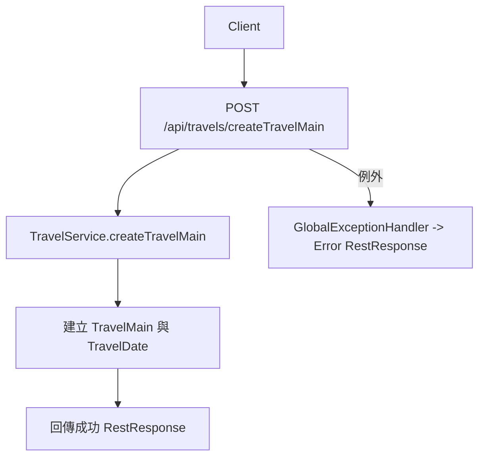
```mermaid
flowchart TD
  A[Client] --> B[POST /api/travels/createTravelMain]
  B --> C[TravelService.createTravelMain]
  C --> D[建立 TravelMain 與 TravelDate]
  D --> E[回傳成功 RestResponse]
  B -->|例外| F[GlobalExceptionHandler -> Error RestResponse]
```

---

### 2. 更新主行程 `POST /updateTravelMain`
- **目的**：更新既有主行程，若日期區間變更會增刪 `TravelDate`。
- **授權**：需要帶入 `Authorization: Bearer <token>`
- **請求範例**
```json
{
  "id": "30c29c31-e9c2-4d0a-81d2-4f2a07123456",
  "isPrivate": true,
  "startDate": "2024-09-02",
  "endDate": "2024-09-06",
  "title": "東京調整後行程",
  "notes": "更新備註",
  "visitPlace": "{\"country\":\"JP\"}"
}
```
- **成功回應**
```json
{
  "data": {
    "id": "30c29c31-e9c2-4d0a-81d2-4f2a07123456",
    "memberId": "a3d2e7b4-1234-4321-9abc-5678def01234",
    "isPrivate": true,
    "startDate": "2024-09-02",
    "endDate": "2024-09-06",
    "title": "東京調整後行程",
    "notes": "更新備註",
    "visitPlace": "{\"country\":\"JP\"}"
  },
  "meta": null,
  "error": null
}
```
- **失敗回應 (範例：TRAVEL_MAIN_NOT_FOUND)**
```json
{
  "data": null,
  "meta": null,
  "error": {
    "code": "TRAVEL_MAIN_NOT_FOUND",
    "message": "Travel main not found",
    "timestamp": "2024-06-01T08:00:00Z"
  }
}
```
- **流程圖**
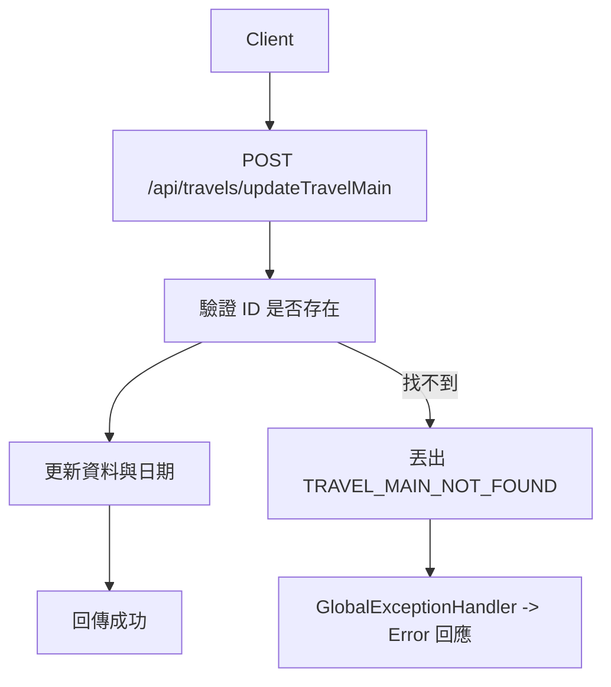
```mermaid
flowchart TD
  A[Client] --> B[POST /api/travels/updateTravelMain]
  B --> C[驗證 ID 是否存在]
  C --> D[更新資料與日期]
  D --> E[回傳成功]
  C -->|找不到| F[丟出 TRAVEL_MAIN_NOT_FOUND]
  F --> G[GlobalExceptionHandler -> Error 回應]
```

---

### 3. 查詢主行程 `POST /getTravelMain`
- **目的**：依主行程 ID 取得單一主行程。
- **請求範例**
```json
{ "id": "30c29c31-e9c2-4d0a-81d2-4f2a07123456" }
```
- **成功回應**
```json
{ "data": { "...TravelMain..." }, "meta": null, "error": null }
```
- **失敗回應 (範例：TRAVEL_MAIN_NOT_FOUND)**
```json
{ "data": null, "meta": null, "error": { "code": "TRAVEL_MAIN_NOT_FOUND", "message": "Travel main not found" } }
```
- **流程圖**
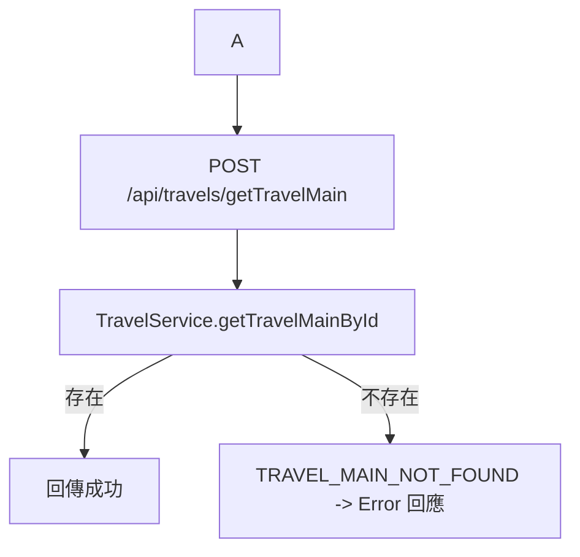
```mermaid
flowchart TD
  A --> B[POST /api/travels/getTravelMain]
  B --> C[TravelService.getTravelMainById]
  C -->|存在| D[回傳成功]
  C -->|不存在| E[TRAVEL_MAIN_NOT_FOUND -> Error 回應]
```

---

### 4. 依會員查詢主行程 `POST /getTravelMainsByMemberId`
- **目的**：取得指定會員的所有主行程。
- **授權**：需要帶入 `Authorization: Bearer <token>`
- **請求範例**：無需 request body
- **成功回應**：`data` 為 `TravelMain` 陣列。
- **失敗回應 (範例：TRAVEL_MEMBER_NOT_FOUND)**
```json
{ "data": null, "meta": null, "error": { "code": "TRAVEL_MEMBER_NOT_FOUND", "message": "Travel member not found" } }
```
- **流程圖**
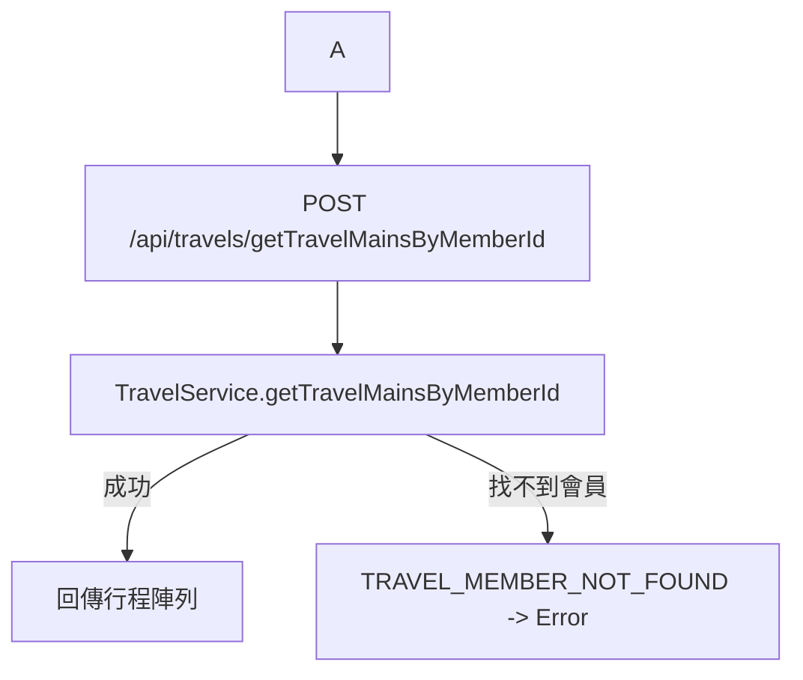
```mermaid
flowchart TD
  A --> B[POST /api/travels/getTravelMainsByMemberId]
  B --> C[TravelService.getTravelMainsByMemberId]
  C -->|成功| D[回傳行程陣列]
  C -->|找不到會員| E[TRAVEL_MEMBER_NOT_FOUND -> Error]
```

---

- ### 5. 複製主行程 `POST /copyTravelPlan`
- **目的**：將某主行程複製給目前登入會員，建立新的主行程及相關資料。
- **授權**：需要帶入 `Authorization: Bearer <token>`
- **請求範例**
```json
{
  "id": "30c29c31-e9c2-4d0a-81d2-4f2a07123456"
}
```
- **成功回應**：`data` 為新建 `TravelMain`。
- **失敗回應 (範例：TRAVEL_MAIN_NOT_FOUND)** 同前述。
- **流程圖**
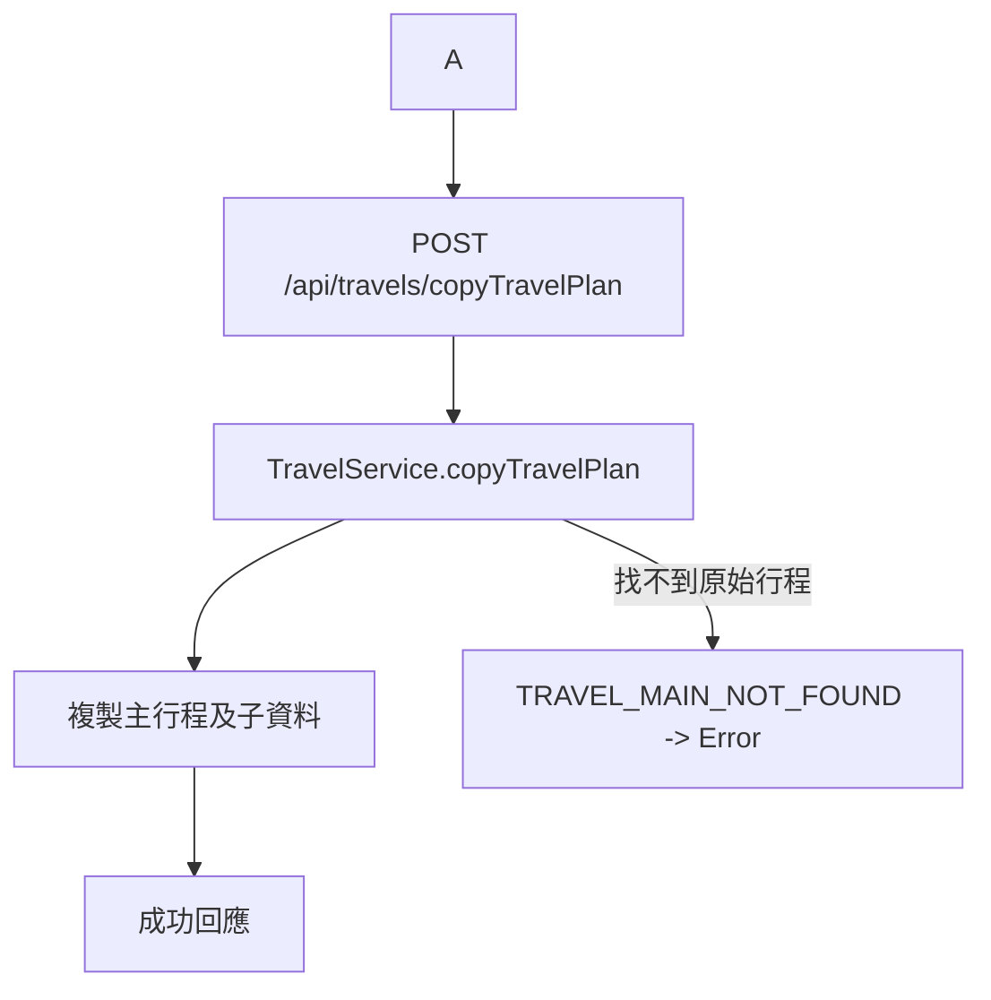
```mermaid
flowchart TD
  A --> B[POST /api/travels/copyTravelPlan]
  B --> C[TravelService.copyTravelPlan]
  C --> D[複製主行程及子資料]
  D --> E[成功回應]
  C -->|找不到原始行程| F[TRAVEL_MAIN_NOT_FOUND -> Error]
```

---

### 6. 新增行程日期 `POST /addTravelDate`
- **目的**：於指定主行程後追加一天行程。
- **授權**：需要帶入 `Authorization: Bearer <token>`
- **請求範例**
```json
{
  "travelMainId": "30c29c31-e9c2-4d0a-81d2-4f2a07123456",
  "travelDate": "2024-09-05"
}
```
- **成功回應**：`data` 為新增的 `TravelDate`。
- **失敗回應 (範例：TRAVEL_MAIN_NOT_FOUND)**
```json
{ "data": null, "error": { "code": "TRAVEL_MAIN_NOT_FOUND", "message": "Travel main not found" } }
```
- **流程圖**
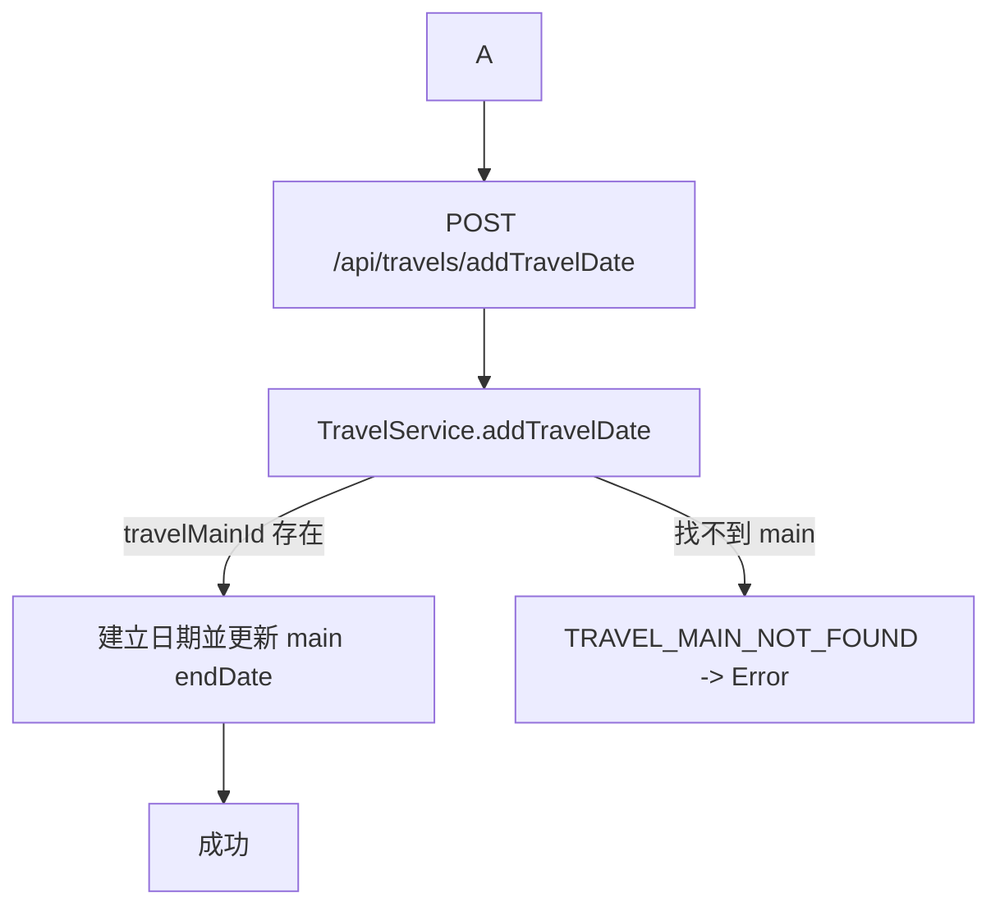
```mermaid
flowchart TD
  A --> B[POST /api/travels/addTravelDate]
  B --> C[TravelService.addTravelDate]
  C -->|travelMainId 存在| D[建立日期並更新 main endDate]
  D --> E[成功]
  C -->|找不到 main| F[TRAVEL_MAIN_NOT_FOUND -> Error]
```

---

### 7. 刪除行程日期 `POST /deleteTravelDate`
- **目的**：刪除特定 `TravelDate`，若刪除最後一天則可能更新主行程結束日期。
- **授權**：需要帶入 `Authorization: Bearer <token>`
- **請求範例**
```json
{ "id": "5d5e5e5e-e9c2-4d0a-81d2-4f2a07123456" }
```
- **成功回應**：`data` 為 `null`。
- **失敗回應 (範例：TRAVEL_DATE_DELETE_LAST_FORBIDDEN)**  
```json
{ "data": null, "error": { "code": "TRAVEL_DATE_DELETE_LAST_FORBIDDEN", "message": "Cannot delete the last travel date" } }
```
- **流程圖**
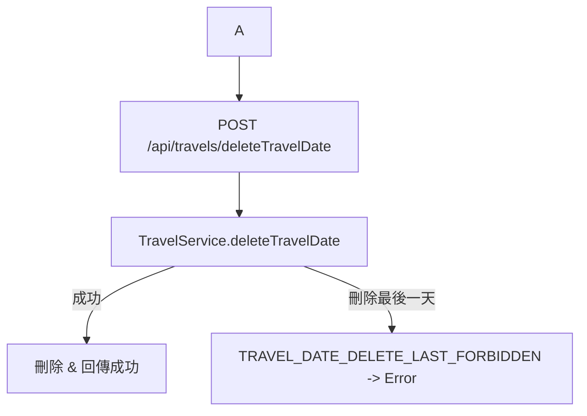
```mermaid
flowchart TD
  A --> B[POST /api/travels/deleteTravelDate]
  B --> C[TravelService.deleteTravelDate]
  C -->|成功| D[刪除 & 回傳成功]
  C -->|刪除最後一天| E[TRAVEL_DATE_DELETE_LAST_FORBIDDEN -> Error]
```

---

### 8. 查詢行程日期 `POST /getTravelDate`
- **目的**：依 ID 取得單一 `TravelDate`。
- **請求範例**
```json
{ "id": "5d5e5e5e-e9c2-4d0a-81d2-4f2a07123456" }
```
- **成功回應**：`data` 為 `TravelDate`。
- **失敗回應 (範例：TRAVEL_DATE_NOT_FOUND)**
```json
{ "data": null, "error": { "code": "TRAVEL_DATE_NOT_FOUND", "message": "Travel date not found" } }
```
- **流程圖**
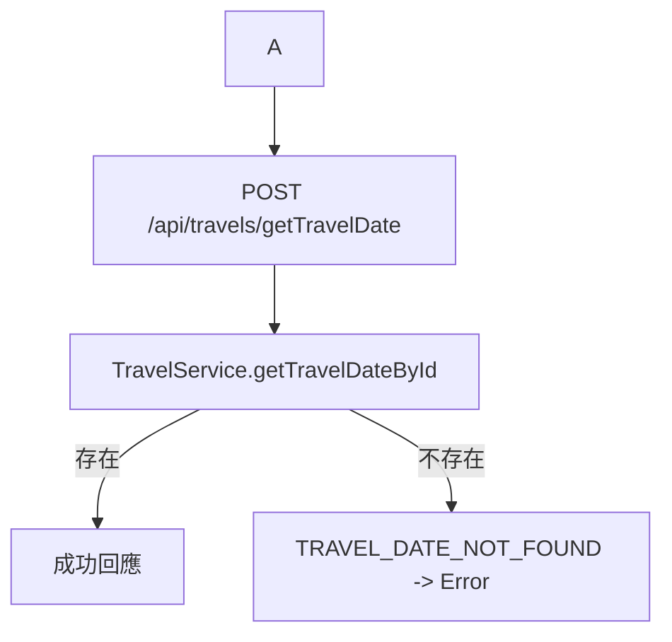
```mermaid
flowchart TD
  A --> B[POST /api/travels/getTravelDate]
  B --> C[TravelService.getTravelDateById]
  C -->|存在| D[成功回應]
  C -->|不存在| E[TRAVEL_DATE_NOT_FOUND -> Error]
```

---

### 9. 依主行程查詢所有日期 `POST /getTravelDatesByTravelMainId`
- **目的**：取得主行程下的全部 `TravelDate`。
- **請求範例**
```json
{ "id": "30c29c31-e9c2-4d0a-81d2-4f2a07123456" }
```
- **成功回應**：`data` 為 `TravelDate` 陣列。
- **失敗回應 (範例：TRAVEL_MAIN_NOT_FOUND)** 同前。
- **流程圖**
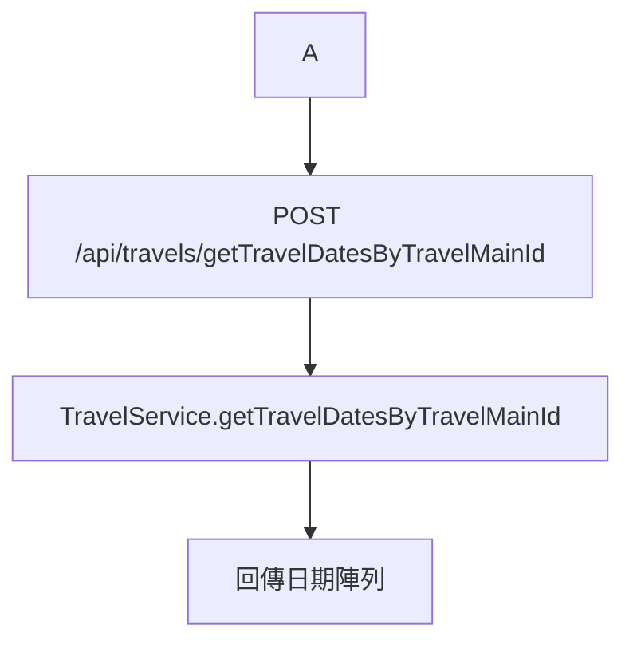
```mermaid
flowchart TD
  A --> B[POST /api/travels/getTravelDatesByTravelMainId]
  B --> C[TravelService.getTravelDatesByTravelMainId]
  C --> D[回傳日期陣列]
```

---

### 10. 建立行程明細 `POST /createTravelDetail`
- **目的**：在特定日期下新增一筆行程明細。
- **授權**：需要帶入 `Authorization: Bearer <token>`
- **請求範例**
```json
{
  "travelMainId": "30c29c31-e9c2-4d0a-81d2-4f2a07123456",
  "travelDateId": "5d5e5e5e-e9c2-4d0a-81d2-4f2a07123456",
  "poiId": "99999999-e9c2-4d0a-81d2-4f2a07123456",
  "sort": 1,
  "startTime": "09:00",
  "endTime": "11:00",
  "notes": "參觀景點"
}
```
- **成功回應**：`data` 為新建 `TravelDetail`。
- **失敗回應 (範例：TRAVEL_DETAIL_TIME_CONFLICT)**
```json
{ "data": null, "error": { "code": "TRAVEL_DETAIL_TIME_CONFLICT", "message": "Time conflict detected" } }
```
- **流程圖**
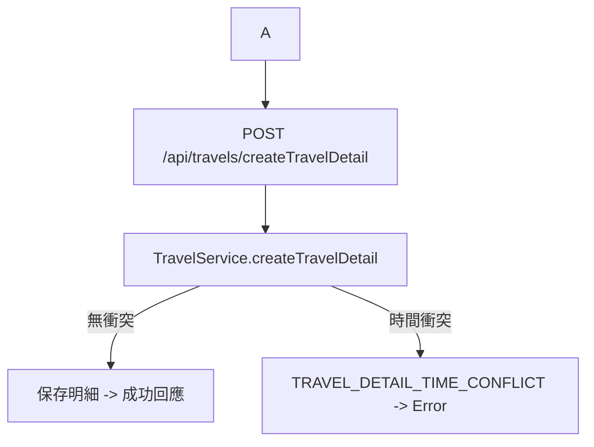
```mermaid
flowchart TD
  A --> B[POST /api/travels/createTravelDetail]
  B --> C[TravelService.createTravelDetail]
  C -->|無衝突| D[保存明細 -> 成功回應]
  C -->|時間衝突| E[TRAVEL_DETAIL_TIME_CONFLICT -> Error]
```

---

### 11. 更新行程明細 `POST /updateTravelDetail`
- **目的**：修改既有明細。
- **授權**：需要帶入 `Authorization: Bearer <token>`
- **請求範例**：同 `createTravelDetail` 但需帶 `id`。
- **成功回應**：`data` 為更新後 `TravelDetail`。
- **失敗回應 (範例：TRAVEL_DETAIL_NOT_FOUND)**
```json
{ "data": null, "error": { "code": "TRAVEL_DETAIL_NOT_FOUND", "message": "Travel detail not found" } }
```
- **流程圖**
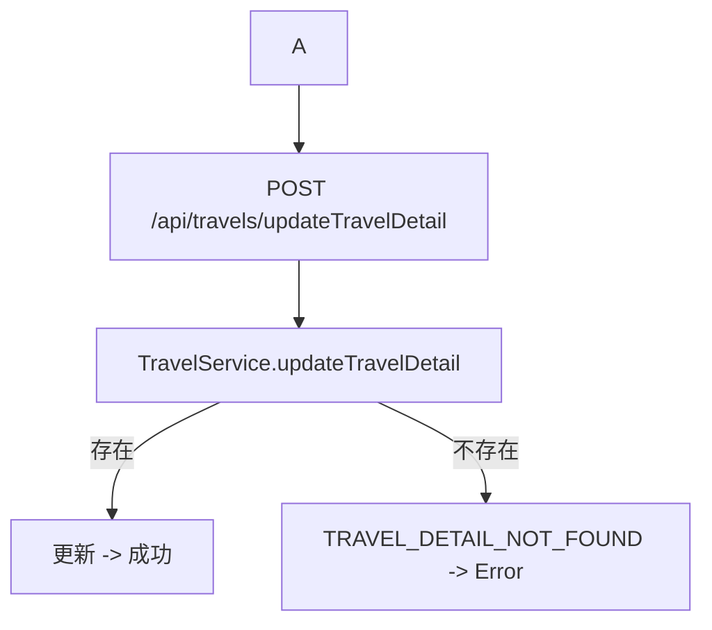
```mermaid
flowchart TD
  A --> B[POST /api/travels/updateTravelDetail]
  B --> C[TravelService.updateTravelDetail]
  C -->|存在| D[更新 -> 成功]
  C -->|不存在| E[TRAVEL_DETAIL_NOT_FOUND -> Error]
```

---

### 12. 調整明細排序 `POST /reorderTravelDetail`
- **目的**：重新排序同日明細。
- **授權**：需要帶入 `Authorization: Bearer <token>`
- **請求範例**
```json
[
  { "id": "detail-1-uuid", "sort": 1 },
  { "id": "detail-2-uuid", "sort": 2 }
]
```
- **成功回應**：`data` 為 `null`。
- **失敗回應 (範例：TRAVEL_DETAILS_NOT_SAME_TRAVEL)**
```json
{ "data": null, "error": { "code": "TRAVEL_DETAILS_NOT_SAME_TRAVEL", "message": "Details not in the same travel" } }
```
- **流程圖**
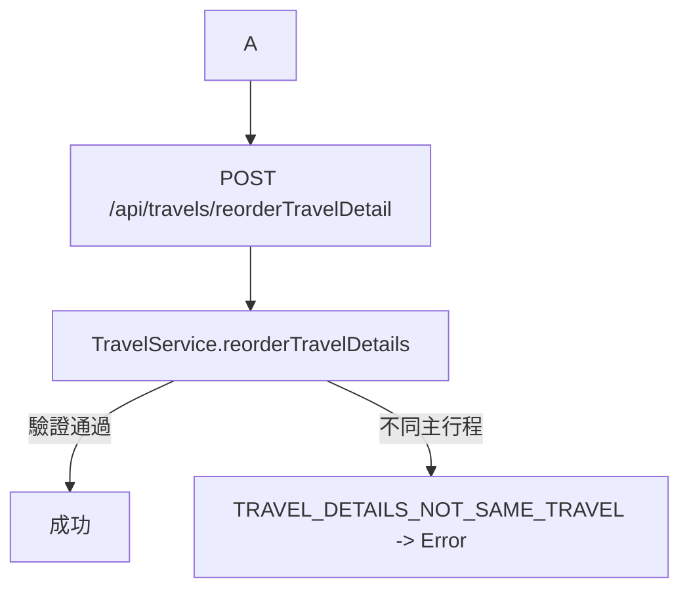
```mermaid
flowchart TD
  A --> B[POST /api/travels/reorderTravelDetail]
  B --> C[TravelService.reorderTravelDetails]
  C -->|驗證通過| D[成功]
  C -->|不同主行程| E[TRAVEL_DETAILS_NOT_SAME_TRAVEL -> Error]
```

---

### 13. 查詢明細 `POST /getTravelDetail`
- **目的**：依 ID 取得單一 `TravelDetail`。
- **請求範例**：`{ "id": "detail-uuid" }`
- **成功回應**：`data` 為 `TravelDetail`。
- **失敗回應**：`TRAVEL_DETAIL_NOT_FOUND`。
- **流程圖**
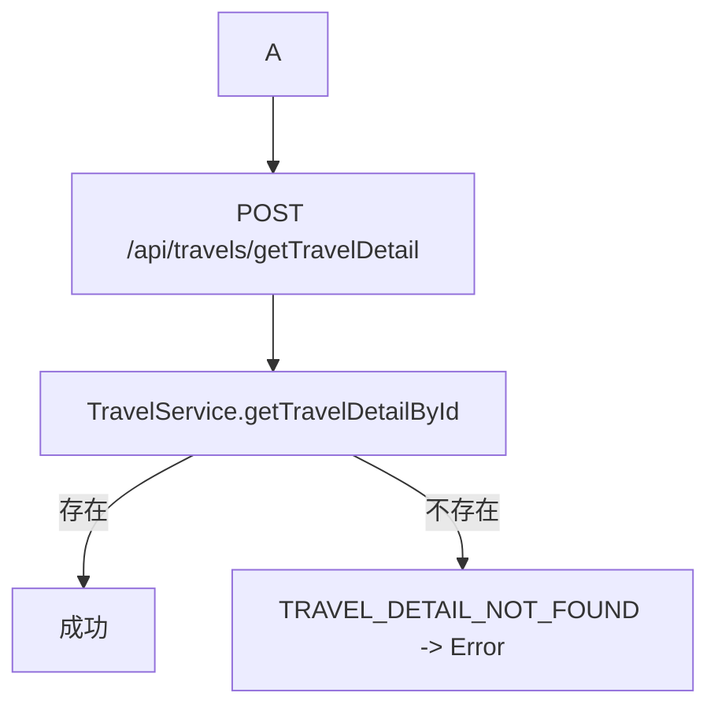
```mermaid
flowchart TD
  A --> B[POST /api/travels/getTravelDetail]
  B --> C[TravelService.getTravelDetailById]
  C -->|存在| D[成功]
  C -->|不存在| E[TRAVEL_DETAIL_NOT_FOUND -> Error]
```

---

### 14. 依日期查詢明細 `POST /getTravelDetailsByTravelDateId`
- **目的**：取得某 `TravelDate` 下的全部明細。
- **請求範例**：`{ "id": "travelDate-uuid" }`
- **成功回應**：`data` 為 `TravelDetail` 陣列。
- **失敗回應**：`TRAVEL_DATE_NOT_FOUND`。
- **流程圖**
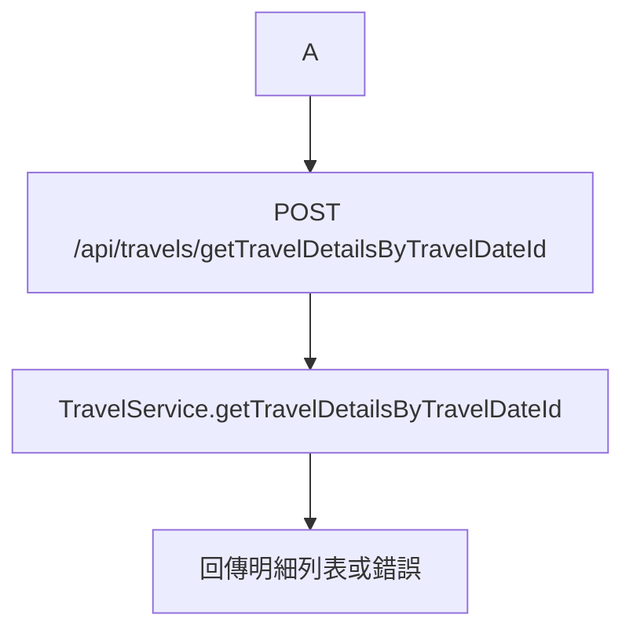
```mermaid
flowchart TD
  A --> B[POST /api/travels/getTravelDetailsByTravelDateId]
  B --> C[TravelService.getTravelDetailsByTravelDateId]
  C --> D[回傳明細列表或錯誤]
```

---

- ### 15. 檢查時間衝突 `POST /checkTimeConflict`
- **目的**：確認明細時間是否與同日其他明細衝突。
- **授權**：需要帶入 `Authorization: Bearer <token>`
- **請求範例**：同 `createTravelDetail` 格式。
- **成功回應**：`data` 為布林值或詳細資訊（Service 回傳結果）。
- **失敗回應 (範例：TRAVEL_DETAIL_INVALID_TIME)**
```json
{ "data": null, "error": { "code": "TRAVEL_DETAIL_INVALID_TIME", "message": "Invalid time range" } }
```
- **流程圖**
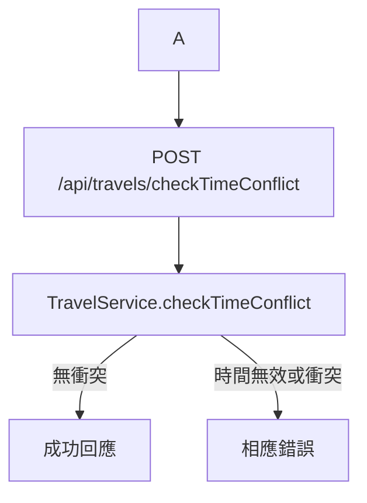
```mermaid
flowchart TD
  A --> B[POST /api/travels/checkTimeConflict]
  B --> C[TravelService.checkTimeConflict]
  C -->|無衝突| D[成功回應]
  C -->|時間無效或衝突| E[相應錯誤]
```

---

- ### 16. 刪除行程明細 `POST /deleteTravelDetail`
- **目的**：刪除單一明細及其相關交通紀錄。
- **授權**：需要帶入 `Authorization: Bearer <token>`
- **請求範例**：`{ "id": "detail-uuid" }`
- **成功回應**：`data` 為 `null`。
- **失敗回應**：`TRAVEL_DETAIL_NOT_FOUND`。
- **流程圖**
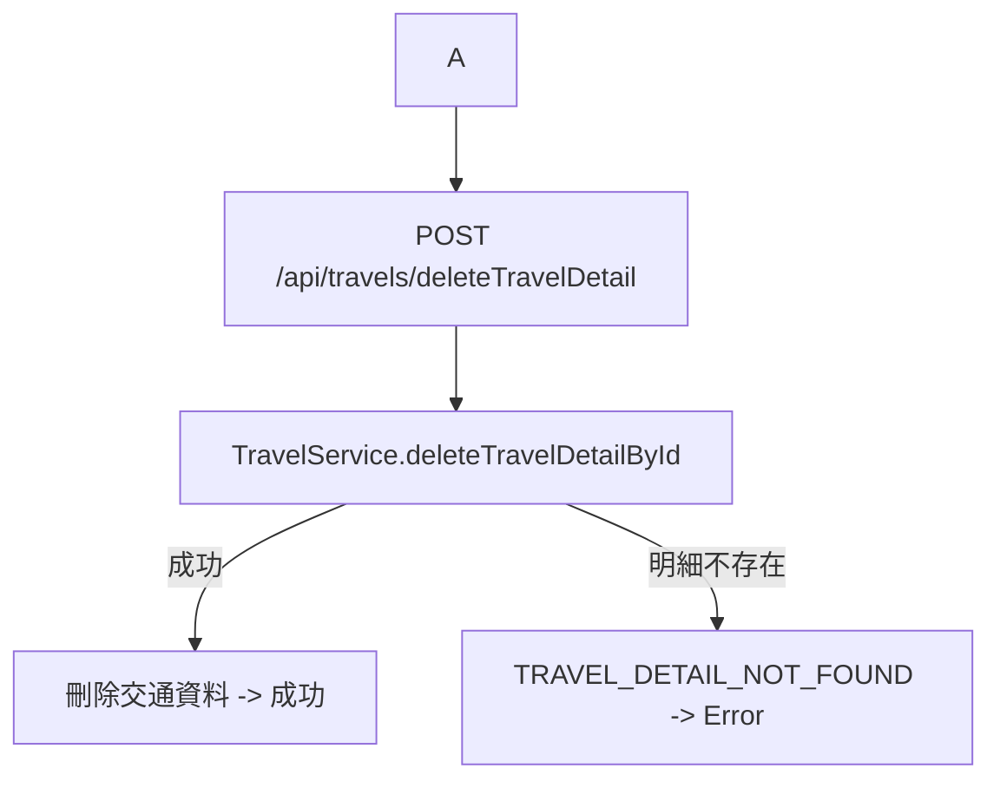
```mermaid
flowchart TD
  A --> B[POST /api/travels/deleteTravelDetail]
  B --> C[TravelService.deleteTravelDetailById]
  C -->|成功| D[刪除交通資料 -> 成功]
  C -->|明細不存在| E[TRAVEL_DETAIL_NOT_FOUND -> Error]
```

---

## TransController (`/api/trans`)

### 1. 建立/更新交通紀錄 `POST /create`
- **目的**：新增或更新兩個行程明細之間的交通資訊。
- **授權**：需要帶入 `Authorization: Bearer <token>`
- **請求範例**
```json
{
  "id": null,
  "langType": "zh",
  "startDetailId": "detail-start-uuid",
  "endDetailId": "detail-end-uuid",
  "infosRaw": "{\"distance\":\"10km\"}",
  "transType": "CAR",
  "transTime": "00:30",
  "summary": "從A到B約30分鐘",
  "notes": "備註"
}
```
- **成功回應**：`data` 為 `TransI18n`。
- **失敗回應 (範例：TRAVEL_DETAIL_NOT_FOUND / TRAVEL_DETAILS_NOT_SAME_TRAVEL)**
```json
{ "data": null, "error": { "code": "TRAVEL_DETAIL_NOT_FOUND", "message": "Travel detail not found" } }
```
- **流程圖**
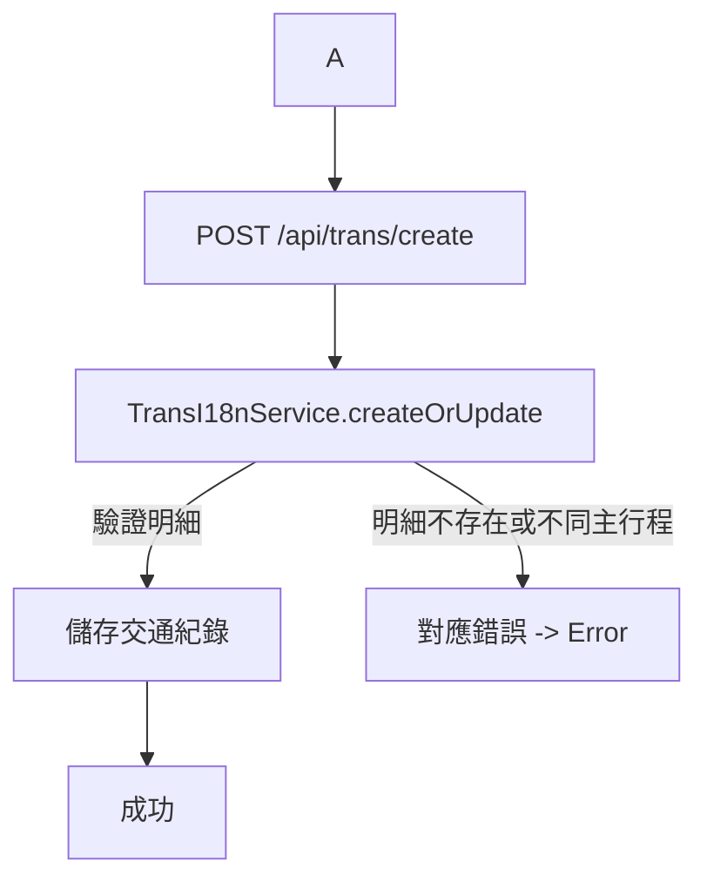
```mermaid
flowchart TD
  A --> B[POST /api/trans/create]
  B --> C[TransI18nService.createOrUpdate]
  C -->|驗證明細| D[儲存交通紀錄]
  D --> E[成功]
  C -->|明細不存在或不同主行程| F[對應錯誤 -> Error]
```

### 2. 刪除交通紀錄 `POST /delete`
- **目的**：依交通紀錄 ID 刪除。
- **授權**：需要帶入 `Authorization: Bearer <token>`
- **請求範例**
```json
{ "id": "trans-uuid" }
```
- **成功回應**：`data` 為 `null`。
- **失敗回應**：若 ID 不存在，仍回傳成功 (JPA delete 無錯誤)。
- **流程圖**
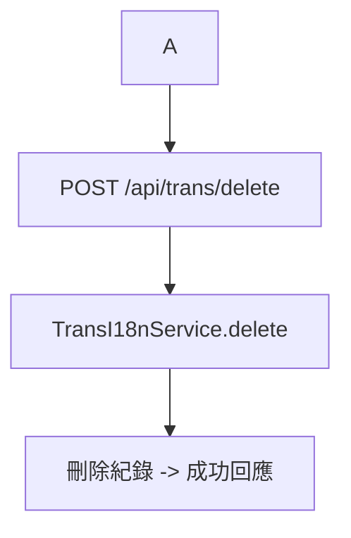
```mermaid
flowchart TD
  A --> B[POST /api/trans/delete]
  B --> C[TransI18nService.delete]
  C --> D[刪除紀錄 -> 成功回應]
```

---

以上為 `TravelController` 與 `TransController` 下所有 POST API 的詳細說明、範例與流程圖。若需整合至專案文件，可直接將本 Markdown 內容納入。
