# Travel & Trans API 文件

以下文件依 `TravelController` 與 `TransController` 的所有 POST API 進行說明，內容包括用途說明、請求範例、成功與失敗回應範例，以及邏輯流程圖。

所有需授權的端點必須在 Header 帶入 `Authorization: Bearer <token>`，後端會透過 `AuthContext.getCurrentMemberId()` 取得會員 ID，前端不需傳送 `memberId` 或 `createdBy`。
---

## TravelController (`/api/travels`)

### 0. 合併建立/更新主行程 `POST /upsertTravelMain`
- **目的**：依 `travelMainId` 是否存在決定建立或更新主行程。
- **授權**：需要帶入 `Authorization: Bearer <token>`
- **請求範例**
```json
{
  "id": "30c29c31-e9c2-4d0a-81d2-4f2a07123456",
  "isPrivate": false,
  "startDate": "2024-09-01",
  "endDate": "2024-09-05",
  "title": "東京五日遊",
  "notes": "備註內容",
  "visitPlace": ["JP-01", "JP-02"]
}
```
- **欄位說明**
  - `id`（UUID，非必填）：要更新的主行程 ID；未提供或查無資料時視為建立。
  - `isPrivate`（Boolean，非必填，預設 `false`）：控制行程是否為私人行程。
  - `startDate`（ISO `yyyy-MM-dd`，必填）：行程開始日期。
  - `endDate`（ISO `yyyy-MM-dd`，必填）：行程結束日期，必須晚於或等於 `startDate`。
  - `title`（String，必填）：主行程標題。
  - `notes`（String，非必填）：行程備註。
  - `visitPlace`（String Array，非必填）：旅遊地點代碼清單，例如 `["JP-01","JP-02"]`。
- **行為**
  - 未傳 `id` 或 DB 查無此 ID → 建立主行程（行為同 `createTravelMain`）。
  - 傳入 `id` 且 DB 有值 → 更新主行程（行為同 `updateTravelMain`）。
- **成功回應**：建立時回傳 `TravelMainResponse`（含 `generatedTravelDates`），更新時回傳 `TravelMain`。
- **成功回應範例（建立）**
```json
{
  "data": {
    "id": "30c29c31-e9c2-4d0a-81d2-4f2a07123456",
    "memberId": "a3d2e7b4-1234-4321-9abc-5678def01234",
    "isPrivate": false,
    "startDate": "2024-09-01",
    "endDate": "2024-09-05",
    "title": "東京五日遊",
    "notes": "備註內容",
    "visitPlace": ["JP-01", "JP-02"],
    "createdAt": "2024-06-01T08:00:00Z",
    "generatedTravelDates": [
      { "id": "...", "travelMainId": "...", "travelDate": "2024-09-01", "sort": 1 },
      { "id": "...", "travelMainId": "...", "travelDate": "2024-09-02", "sort": 2 }
    ]
  },
  "meta": null,
  "error": null
}
```
- **成功回應範例（更新）**
```json
{
  "data": {
    "id": "30c29c31-e9c2-4d0a-81d2-4f2a07123456",
    "memberId": "a3d2e7b4-1234-4321-9abc-5678def01234",
    "isPrivate": true,
    "startDate": "2024-09-02",
    "endDate": "2024-09-06",
    "title": "東京調整後行程",
    "notes": "更新備註",
    "visitPlace": ["JP-01", "JP-02"],
  },
  "meta": null,
  "error": null
}
```
- **錯誤回應（欄位錯誤陣列固定回傳）**
  - `error.fieldErrors` 必定包含以下欄位，無錯誤時 `message` 為空字串：
    - `title`
    - `startDate`
    - `endDate`
    - `visitPlace`
    - `notes`
```json
{
  "data": null,
  "meta": null,
  "error": {
    "code": "欄位有誤",
    "message": "欄位有誤",
    "fieldErrors": [
      { "field": "title", "message": "" },
      { "field": "startDate", "message": "Start date is required" },
      { "field": "endDate", "message": "" },
      { "field": "visitPlace", "message": "" },
      { "field": "notes", "message": "" }
    ]
  }
}
```

### 1. 建立主行程 `POST /createTravelMain`
- **目的**：建立新的旅遊主行程並自動產生對應的每日行程 `TravelDate`。
- **授權**：需要帶入 `Authorization: Bearer <token>`
- **請求範例**
```json
{
  "isPrivate": false,
  "startDate": "2024-09-01",
  "endDate": "2024-09-05",
  "title": "東京五日遊",
  "notes": "備註內容",
  "visitPlace": ["JP-01", "JP-02"]
}
```
- **欄位說明**
  - `isPrivate`（Boolean，非必填，預設 `false`）：控制行程是否為私人行程。
  - `startDate`（ISO `yyyy-MM-dd`，必填）：行程開始日期。
  - `endDate`（ISO `yyyy-MM-dd`，必填）：行程結束日期，必須晚於或等於 `startDate`。
  - `title`（String，必填）：主行程標題。
  - `notes`（String，非必填）：行程備註。
  - `visitPlace`（String Array，非必填）：旅遊地點代碼清單，例如 `["JP-01","JP-02"]`。
  - **行程天數限制**：`startDate` 至 `endDate`（含首尾）不可超過系統設定的最大天數（預設 31 天，可在設定檔 `travel.max-days` 調整）。
- **成功回應**
```json
{
  "data": {
    "id": "30c29c31-e9c2-4d0a-81d2-4f2a07123456",
    "memberId": "a3d2e7b4-1234-4321-9abc-5678def01234",
    "isPrivate": false,
    "startDate": "2024-09-01",
    "endDate": "2024-09-05",
    "title": "東京五日遊",
    "notes": "備註內容",
    "visitPlace": ["JP-01", "JP-02"],
    "createdAt": "2024-06-01T08:00:00Z",
    "generatedTravelDates": [
      { "id": "...", "travelMainId": "...", "travelDate": "2024-09-01", "sort": 1 },
      { "id": "...", "travelMainId": "...", "travelDate": "2024-09-02", "sort": 2 },
      { "id": "...", "travelMainId": "...", "travelDate": "2024-09-03", "sort": 3 },
      { "id": "...", "travelMainId": "...", "travelDate": "2024-09-04", "sort": 4 },
      { "id": "...", "travelMainId": "...", "travelDate": "2024-09-05", "sort": 5 }
    ]
  },
  "meta": null,
  "error": null
}
```
- **失敗回應 (範例：TRAVEL_MEMBER_NOT_FOUND)**
```json
{
  "data": null,
  "meta": null,
  "error": {
    "code": "TRAVEL_MEMBER_NOT_FOUND",
    "message": "Travel member not found",
    "timestamp": "2024-06-01T08:00:00Z",
    "details": null
  }
}
```
- **流程圖**
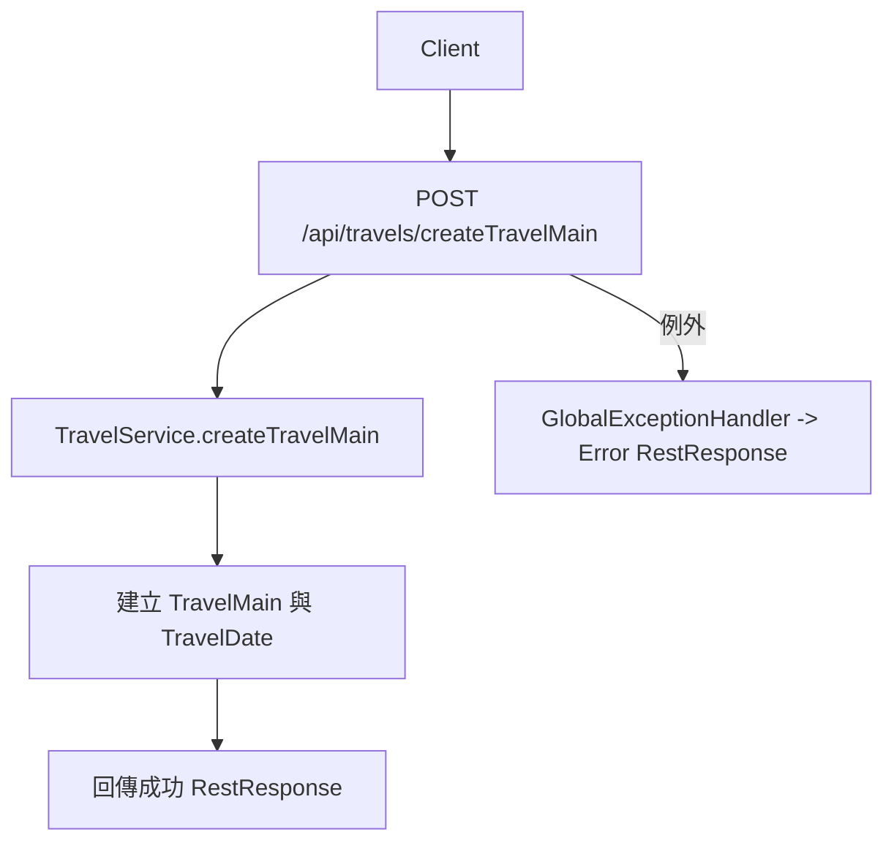
```mermaid
flowchart TD
  A[Client] --> B[POST /api/travels/createTravelMain]
  B --> C[TravelService.createTravelMain]
  C --> D[建立 TravelMain 與 TravelDate]
  D --> E[回傳成功 RestResponse]
  B -->|例外| F[GlobalExceptionHandler -> Error RestResponse]
```

---

### 2. 更新主行程 `POST /updateTravelMain`
- **目的**：更新既有主行程，若日期區間變更會增刪 `TravelDate`。
- **授權**：需要帶入 `Authorization: Bearer <token>`
- **請求範例**
```json
{
  "id": "30c29c31-e9c2-4d0a-81d2-4f2a07123456",
  "isPrivate": true,
  "startDate": "2024-09-02",
  "endDate": "2024-09-06",
  "title": "東京調整後行程",
  "notes": "更新備註",
  "visitPlace": ["JP-01", "JP-02"]
}
```
- **欄位說明**
  - `id`（UUID，必填）：欲更新的主行程 ID。
  - `isPrivate`（Boolean，非必填）：為 `null` 時維持原設定。
  - `startDate`（ISO `yyyy-MM-dd`，必填）：調整後的開始日期。
  - `endDate`（ISO `yyyy-MM-dd`，必填）：調整後的結束日期。
  - `title`（String，必填）：主行程標題。
  - `notes`（String，非必填）：行程備註。
  - `visitPlace`（String Array，非必填）：旅遊地點代碼清單，例如 `["JP-01","JP-02"]`。
- **成功回應**
```json
{
  "data": {
    "id": "30c29c31-e9c2-4d0a-81d2-4f2a07123456",
    "memberId": "a3d2e7b4-1234-4321-9abc-5678def01234",
    "isPrivate": true,
    "startDate": "2024-09-02",
    "endDate": "2024-09-06",
    "title": "東京調整後行程",
    "notes": "更新備註",
    "visitPlace": ["JP-01", "JP-02"]
  },
  "meta": null,
  "error": null
}
```
- **失敗回應 (範例：TRAVEL_MAIN_NOT_FOUND)**
```json
{
  "data": null,
  "meta": null,
  "error": {
    "code": "TRAVEL_MAIN_NOT_FOUND",
    "message": "Travel main not found",
    "timestamp": "2024-06-01T08:00:00Z"
  }
}
```
- **流程圖**
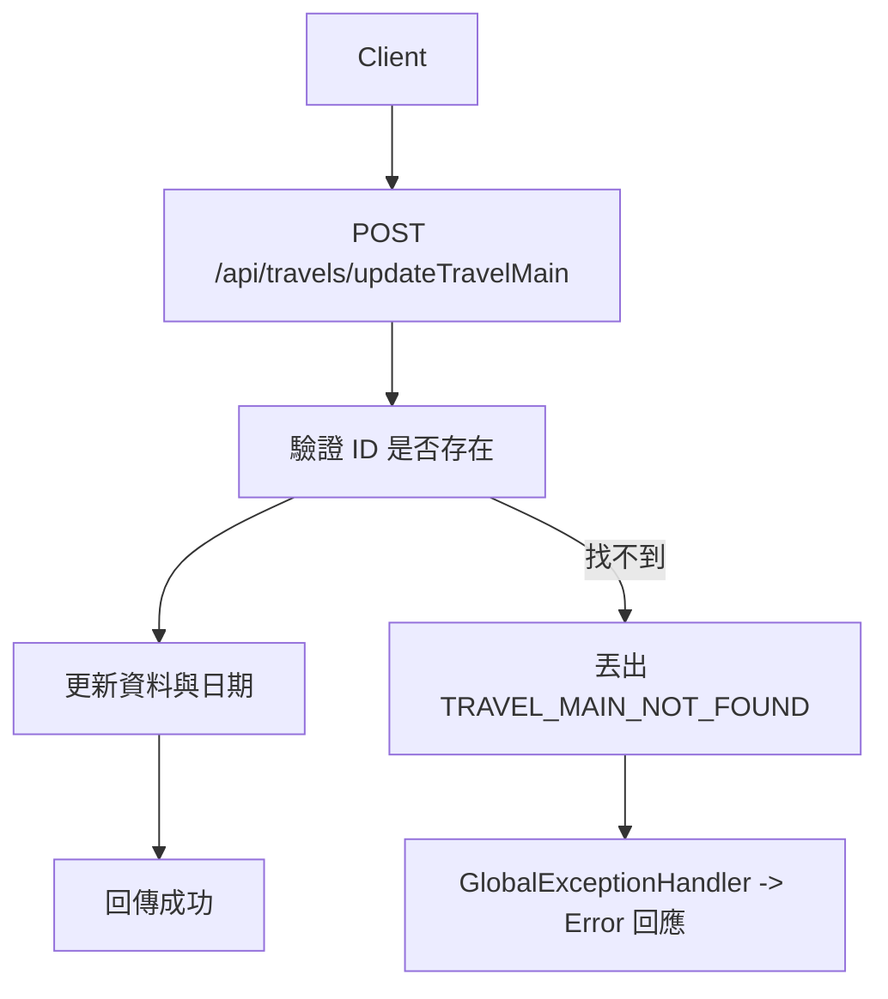
```mermaid
flowchart TD
  A[Client] --> B[POST /api/travels/updateTravelMain]
  B --> C[驗證 ID 是否存在]
  C --> D[更新資料與日期]
  D --> E[回傳成功]
  C -->|找不到| F[丟出 TRAVEL_MAIN_NOT_FOUND]
  F --> G[GlobalExceptionHandler -> Error 回應]
```

---

### 3. 查詢主行程 `POST /getTravelMain`
- **目的**：依主行程 ID 取得單一主行程。
- **請求範例**
```json
{ "id": "30c29c31-e9c2-4d0a-81d2-4f2a07123456" }
```
- **成功回應**
```json
{ "data": { "...TravelMain..." }, "meta": null, "error": null }
```
- **失敗回應 (範例：TRAVEL_MAIN_NOT_FOUND)**
```json
{ "data": null, "meta": null, "error": { "code": "TRAVEL_MAIN_NOT_FOUND", "message": "Travel main not found" } }
```
- **流程圖**
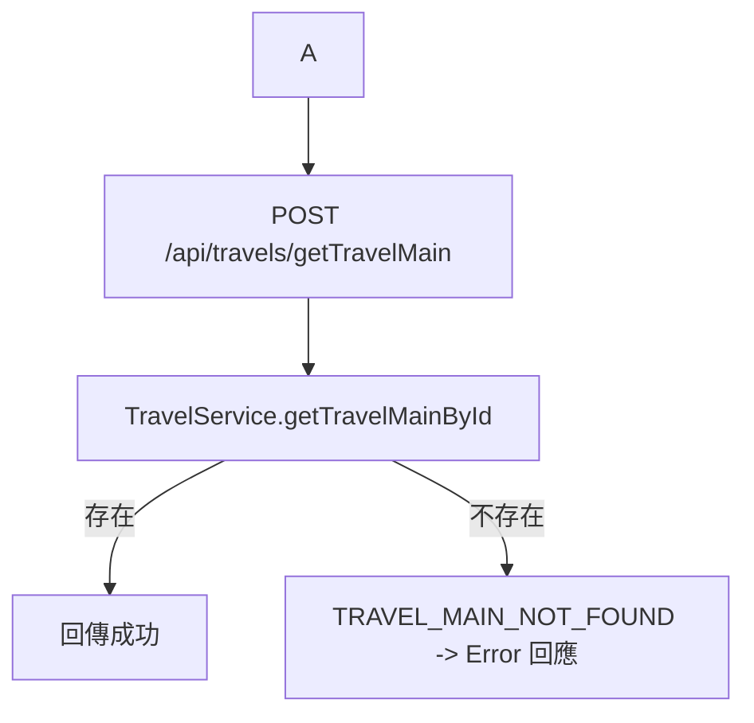
```mermaid
flowchart TD
  A --> B[POST /api/travels/getTravelMain]
  B --> C[TravelService.getTravelMainById]
  C -->|存在| D[回傳成功]
  C -->|不存在| E[TRAVEL_MAIN_NOT_FOUND -> Error 回應]
```

---

### 4. 依會員查詢主行程 `POST /getTravelMainsByMemberId`
- **目的**：取得指定會員的所有主行程。
- **授權**：需要帶入 `Authorization: Bearer <token>`
- **請求範例**：無需 request body
- **成功回應**：`data` 為 `TravelMain` 陣列。
- **失敗回應 (範例：TRAVEL_MEMBER_NOT_FOUND)**
```json
{ "data": null, "meta": null, "error": { "code": "TRAVEL_MEMBER_NOT_FOUND", "message": "Travel member not found" } }
```
- **流程圖**
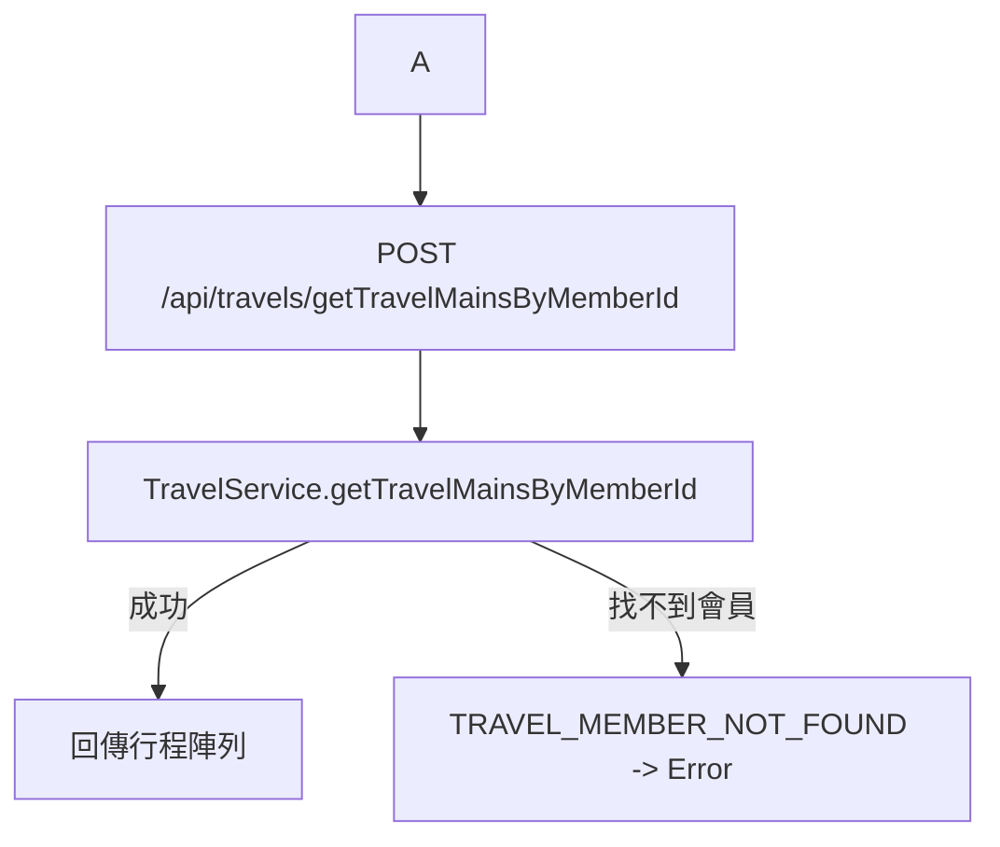
```mermaid
flowchart TD
  A --> B[POST /api/travels/getTravelMainsByMemberId]
  B --> C[TravelService.getTravelMainsByMemberId]
  C -->|成功| D[回傳行程陣列]
  C -->|找不到會員| E[TRAVEL_MEMBER_NOT_FOUND -> Error]
```

---

- ### 4.1 分頁取得主行程列表 `POST /listTravelMains`
- **目的**：以分頁方式取得登入會員的主行程清單，回傳結構與景點收藏列表一致（含 `PageMeta`）。
- **授權**：需要帶入 `Authorization: Bearer <token>`
- **請求範例**
```json
{
  "page": 1,
  "size": 10
}
```
- **欄位說明**
  - `page`（Integer，非必填，預設 `1`）：頁碼，需大於等於 1。
  - `size`（Integer，非必填，預設 `10`）：每頁筆數，允許範圍 1~50。
- **成功回應**
```json
{
  "data": {
    "list": [
      {
        "travelMainId": "30c29c31-e9c2-4d0a-81d2-4f2a07123456",
        "title": "東京五日遊",
        "startDate": "2024-09-01",
        "endDate": "2024-09-05",
        "isPrivate": false,
        "createdAt": "2024-06-01T08:00:00Z",
        "updatedAt": "2024-06-05T08:00:00Z"
      }
    ],
    "meta": {
      "page": 1,
      "size": 10,
      "totalPages": 3,
      "totalElements": 24,
      "hasNext": true,
      "hasPrev": false
    }
  },
  "meta": null,
  "error": null
}
```
- **備註**：
  - 如未帶入 `page`/`size`，後端會套用預設值。
  - 回應由 `ResponseBodyWrapperAdvice` 自動包裝成標準 `RestResponse` 格式。

---

- ### 5. 複製主行程 `POST /copyTravelPlan`
- **目的**：將某主行程複製給目前登入會員，建立新的主行程及相關資料。
- **授權**：需要帶入 `Authorization: Bearer <token>`
- **請求範例**
```json
{
  "id": "30c29c31-e9c2-4d0a-81d2-4f2a07123456"
}
```
- **成功回應**：`data` 為新建 `TravelMain`。
- **失敗回應 (範例：TRAVEL_MAIN_NOT_FOUND)** 同前述。
- **流程圖**
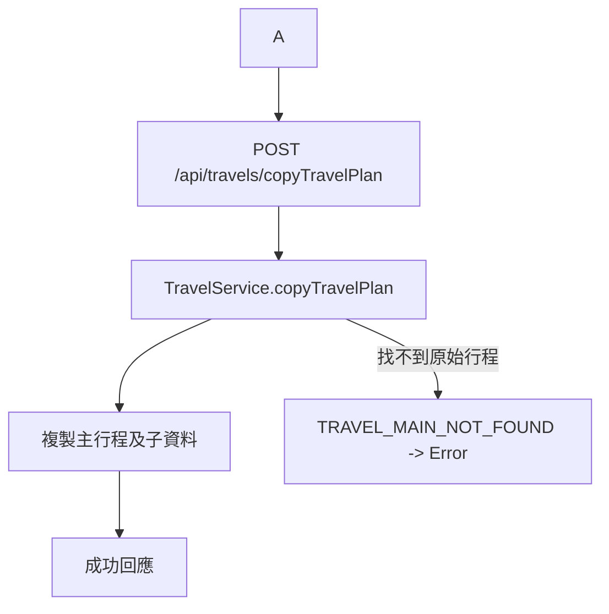
```mermaid
flowchart TD
  A --> B[POST /api/travels/copyTravelPlan]
  B --> C[TravelService.copyTravelPlan]
  C --> D[複製主行程及子資料]
  D --> E[成功回應]
  C -->|找不到原始行程| F[TRAVEL_MAIN_NOT_FOUND -> Error]
```

---

### 6. 新增行程日期 `POST /addTravelDate`
- **目的**：於指定主行程後追加一天行程。
- **授權**：需要帶入 `Authorization: Bearer <token>`
- **請求範例**
```json
{
  "travelMainId": "30c29c31-e9c2-4d0a-81d2-4f2a07123456"
}
```
- **欄位說明**
  - `travelMainId`（UUID，必填）：主行程 ID。
  - **行為**：系統會查詢該行程現有最後一天，自動往後新增一天；若新增後超過行程天數上限（預設 31 天，可透過 `travel.max-days` 調整），會回傳錯誤。
- **成功回應**：`data` 為新增的 `TravelDate`（系統計算出的下一天，含 `sort`）。
- **失敗回應 (範例：TRAVEL_MAIN_NOT_FOUND，或超過天數上限 TRAVEL_DATE_EXCEEDS_MAX_DAYS)**
```json
{ "data": null, "error": { "code": "TRAVEL_MAIN_NOT_FOUND", "message": "Travel main not found" } }
```
- **流程圖**
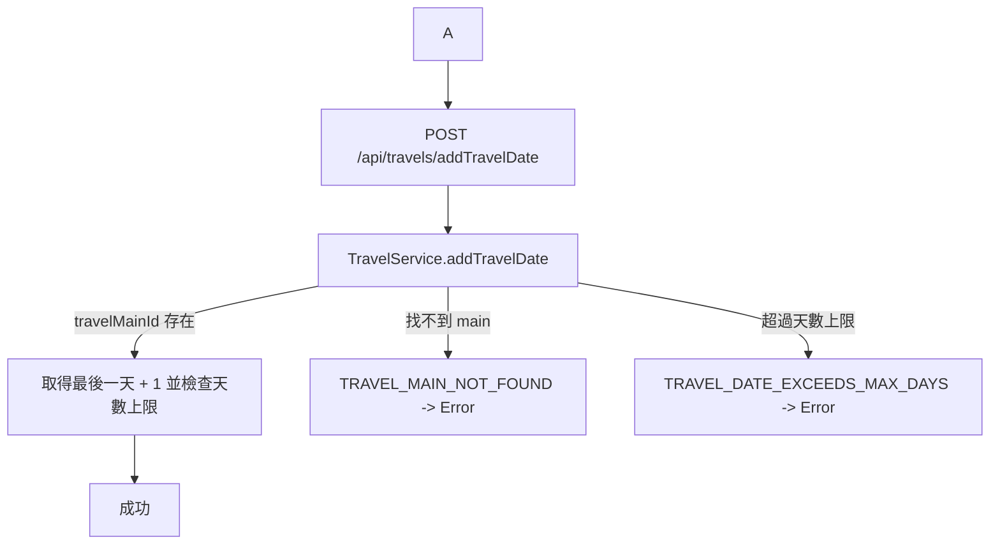
```mermaid
flowchart TD
  A --> B[POST /api/travels/addTravelDate]
  B --> C[TravelService.addTravelDate]
  C -->|travelMainId 存在| D[取得最後一天 + 1 並檢查天數上限]
  D --> E[成功]
  C -->|找不到 main| F[TRAVEL_MAIN_NOT_FOUND -> Error]
  C -->|超過天數上限| G[TRAVEL_DATE_EXCEEDS_MAX_DAYS -> Error]
```

---

### 7. 刪除行程日期 `POST /deleteTravelDate`
- **目的**：刪除特定 `TravelDate`，若刪除最後一天則可能更新主行程結束日期。
- **授權**：需要帶入 `Authorization: Bearer <token>`
- **請求範例**
```json
{ "id": "5d5e5e5e-e9c2-4d0a-81d2-4f2a07123456" }
```
- **成功回應**：`data` 為 `null`。
- **失敗回應 (範例：TRAVEL_DATE_DELETE_LAST_FORBIDDEN)**  
```json
{ "data": null, "error": { "code": "TRAVEL_DATE_DELETE_LAST_FORBIDDEN", "message": "Cannot delete the last travel date" } }
```
- **流程圖**
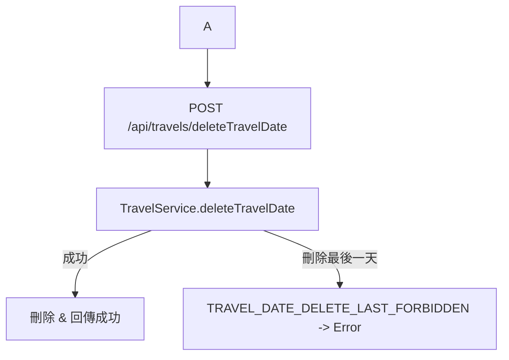
```mermaid
flowchart TD
  A --> B[POST /api/travels/deleteTravelDate]
  B --> C[TravelService.deleteTravelDate]
  C -->|成功| D[刪除 & 回傳成功]
  C -->|刪除最後一天| E[TRAVEL_DATE_DELETE_LAST_FORBIDDEN -> Error]
```

---

### 8. 查詢行程日期 `POST /getTravelDate`
- **目的**：依 ID 取得單一 `TravelDate`。
- **請求範例**
```json
{ "id": "5d5e5e5e-e9c2-4d0a-81d2-4f2a07123456" }
```
- **成功回應**：`data` 為 `TravelDate`。
- **失敗回應 (範例：TRAVEL_DATE_NOT_FOUND)**
```json
{ "data": null, "error": { "code": "TRAVEL_DATE_NOT_FOUND", "message": "Travel date not found" } }
```
- **流程圖**
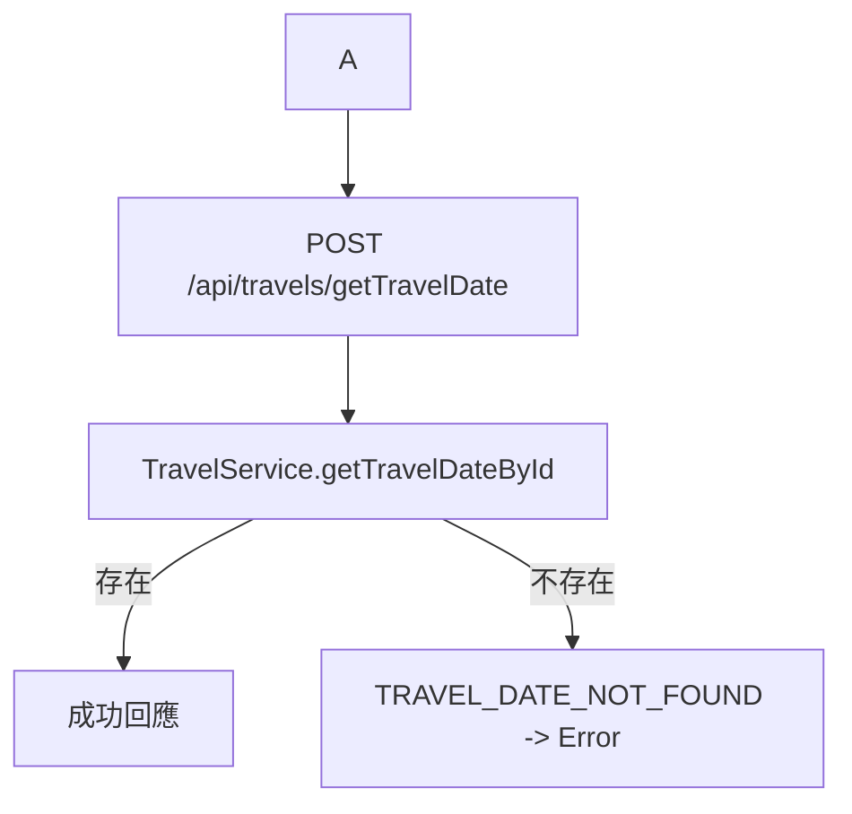
```mermaid
flowchart TD
  A --> B[POST /api/travels/getTravelDate]
  B --> C[TravelService.getTravelDateById]
  C -->|存在| D[成功回應]
  C -->|不存在| E[TRAVEL_DATE_NOT_FOUND -> Error]
```

---

### 9. 依主行程查詢所有日期 `POST /getTravelDatesByTravelMainId`
- **目的**：取得主行程下的全部 `TravelDate`（依 `sort` 排序）。
- **請求範例**
```json
{ "id": "30c29c31-e9c2-4d0a-81d2-4f2a07123456" }
```
- **成功回應**：`data` 為 `TravelDate` 陣列（包含 `sort` 欄位）。
- **失敗回應 (範例：TRAVEL_MAIN_NOT_FOUND)** 同前。
- **流程圖**
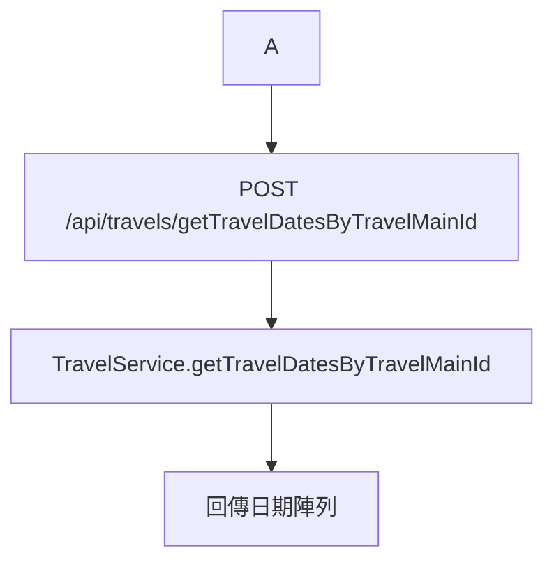
```mermaid
flowchart TD
  A --> B[POST /api/travels/getTravelDatesByTravelMainId]
  B --> C[TravelService.getTravelDatesByTravelMainId]
  C --> D[回傳日期陣列]
```

---

### 9.1 調整行程日期順序 `POST /reorderTravelDates`
- **目的**：依前端傳入的排序調整 `TravelDate` 的 `sort`，並同步調換各日期下的 `TravelDetail`。
- **授權**：需要帶入 `Authorization: Bearer <token>`
- **請求範例**
```json
{
  "travelMainId": "30c29c31-e9c2-4d0a-81d2-4f2a07123456",
  "orders": [
    { "travelDateId": "5d5e5e5e-e9c2-4d0a-81d2-4f2a07123456", "sort": 1 },
    { "travelDateId": "7d7e7e7e-e9c2-4d0a-81d2-4f2a07123456", "sort": 2 }
  ]
}
```
- **欄位說明**
  - `travelMainId`（UUID，必填）：主行程 ID。
  - `orders`（Array，必填）：新的排序清單。
    - `travelDateId`（UUID，必填）：行程日期 ID。
    - `sort`（Integer，必填）：新的排序值（從 1 開始，需連續且不可重複）。
- **成功回應**：`data` 為 `null`。
- **失敗回應 (範例：TRAVEL_DATE_SORT_INVALID)**
```json
{ "data": null, "error": { "code": "TRAVEL_DATE_SORT_INVALID", "message": "Travel date sort is invalid" } }
```
- **流程圖**
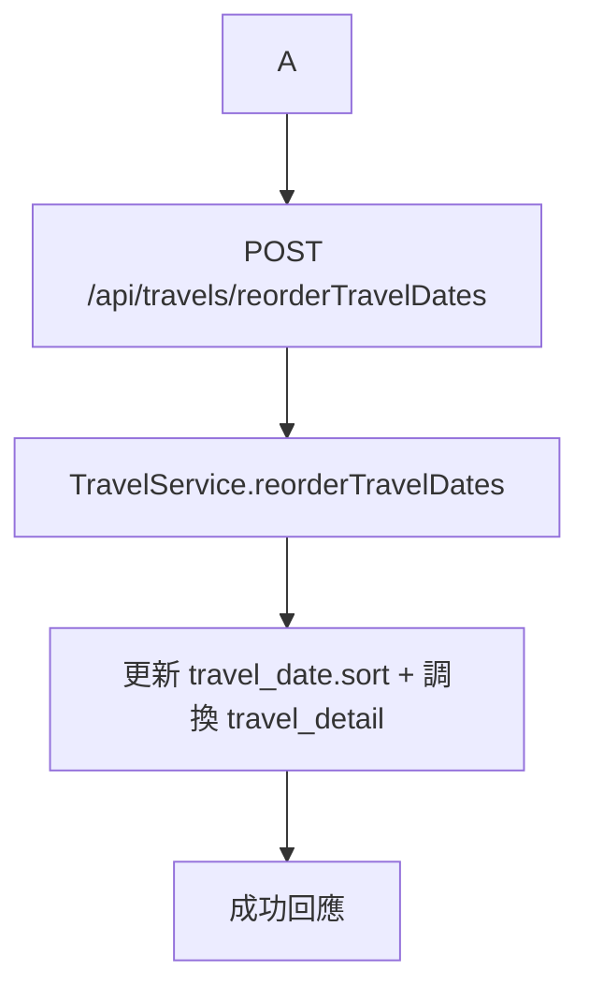
```mermaid
flowchart TD
  A --> B[POST /api/travels/reorderTravelDates]
  B --> C[TravelService.reorderTravelDates]
  C --> D[更新 travel_date.sort + 調換 travel_detail]
  D --> E[成功回應]
```

---

### 10. 建立行程明細 `POST /createTravelDetail`
- **目的**：在特定日期下新增一筆行程明細。
- **授權**：需要帶入 `Authorization: Bearer <token>`
- **請求範例**
```json
{
  "travelMainId": "30c29c31-e9c2-4d0a-81d2-4f2a07123456",
  "travelDateId": "5d5e5e5e-e9c2-4d0a-81d2-4f2a07123456",
  "poiId": "99999999-e9c2-4d0a-81d2-4f2a07123456",
  "sort": 1,
  "startTime": "09:00",
  "endTime": "11:00",
  "notes": "參觀景點"
}
```
- **欄位說明**
  - `travelMainId`（UUID，必填）：主行程 ID。
  - `travelDateId`（UUID，必填）：行程日期 ID。
  - `poiId`（UUID，必填）：對應景點或地點 ID。
  - `sort`（Integer，非必填，忽略輸入）：後端會自動決定排序值。
  - `startTime`（ISO `HH:mm`，必填）：明細開始時間。
  - `endTime`（ISO `HH:mm`，必填）：明細結束時間，需晚於 `startTime`。
  - `notes`（String，非必填）：明細備註。
- **成功回應**：`data` 為新建 `TravelDetail`。
- **失敗回應 (範例：TRAVEL_DETAIL_TIME_CONFLICT)**
```json
{ "data": null, "error": { "code": "TRAVEL_DETAIL_TIME_CONFLICT", "message": "Time conflict detected" } }
```
- **流程圖**
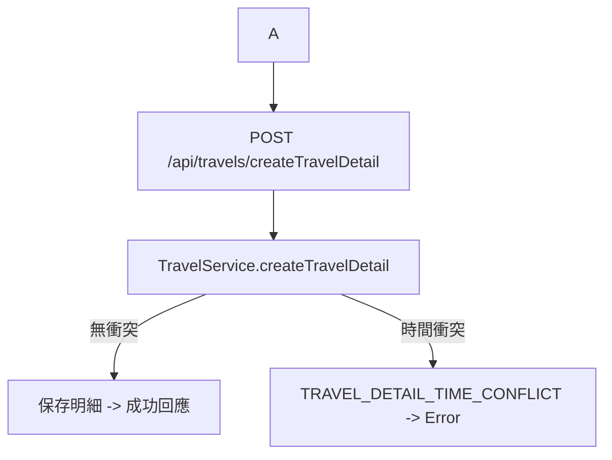
```mermaid
flowchart TD
  A --> B[POST /api/travels/createTravelDetail]
  B --> C[TravelService.createTravelDetail]
  C -->|無衝突| D[保存明細 -> 成功回應]
  C -->|時間衝突| E[TRAVEL_DETAIL_TIME_CONFLICT -> Error]
```

---

### 10.1 建立景點行程明細 `POST /createTravelDetailByPoi`
- **目的**：依主行程 ID、行程日期 ID 與 POI ID，自動在該日期下新增行程明細，排序與時間由後端推算。
- **授權**：需要帶入 `Authorization: Bearer <token>`，系統會以 Token 中的會員 ID 作為 `createdBy`。
- **請求範例**
```json
{
  "travelMainId": "30c29c31-e9c2-4d0a-81d2-4f2a07123456",
  "travelDateId": "5d5e5e5e-e9c2-4d0a-81d2-4f2a07123456",
  "poiId": "99999999-e9c2-4d0a-81d2-4f2a07123456"
}
```
- **欄位說明**
  - `travelMainId`（UUID，必填）：主行程 ID，必須為當前登入會員所擁有。
  - `travelDateId`（UUID，必填）：行程日期 ID，需隸屬於 `travelMainId`。
  - `poiId`（UUID，必填）：欲新增的景點/地點 ID，必須存在。
- **新增規則**
  - 若該日期尚無任何明細，建立首筆明細，`sort` 預設為 `1`，`startTime` 為 `09:00`，`endTime` 為 `10:00`，`timeConflict` 預設 `false`。
  - 若該日期已有明細，依 `sort` 與開始時間排序後，於最後一筆之後新增，`sort` 以最後一筆 +1；新明細的 `startTime` 取最後一筆的 `endTime`（若 `endTime` 為空則以 `startTime+1h`），`endTime` 再向後 1 小時。
- **成功回應**：`data` 為新建的 `TravelDetail`，時間與排序由後端計算。
- **失敗回應 (範例：TRAVEL_POI_NOT_FOUND / TRAVEL_MAIN_NOT_FOUND / TRAVEL_DATE_NOT_FOUND)**
```json
{ "data": null, "error": { "code": "TRAVEL_POI_NOT_FOUND", "message": "Travel poi not found" } }
```
- **流程圖**
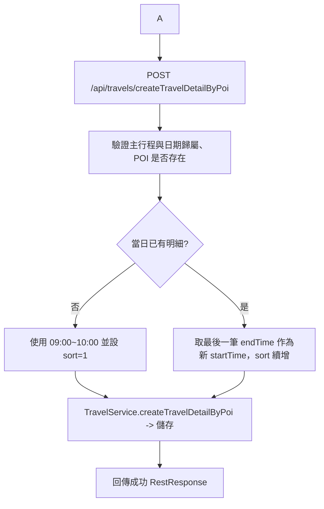
```mermaid
flowchart TD
  A --> B[POST /api/travels/createTravelDetailByPoi]
  B --> C[驗證主行程與日期歸屬、POI 是否存在]
  C --> D{當日已有明細?}
  D -->|否| E[使用 09:00~10:00 並設 sort=1]
  D -->|是| F[取最後一筆 endTime 作為新 startTime，sort 續增]
  E --> G[TravelService.createTravelDetailByPoi -> 儲存]
  F --> G[TravelService.createTravelDetailByPoi -> 儲存]
  G --> H[回傳成功 RestResponse]
```

---


### 11. 更新行程明細 `POST /updateTravelDetail`
- **目的**：修改既有明細。
- **授權**：需要帶入 `Authorization: Bearer <token>`
- **請求範例**：同 `createTravelDetail` 但需帶 `id`。
- **欄位補充**：
  - `id`（UUID，必填）：要更新的明細 ID。
  - `poiId`（UUID，非必填）：調整景點時傳入新值；不變更可省略。
  - `sort`（Integer，非必填）：若需手動指定排序可傳入，否則保持現值。
  - `notes`（String，非必填）：明細備註內容。
- **成功回應**：`data` 為更新後 `TravelDetail`。
- **失敗回應 (範例：TRAVEL_DETAIL_NOT_FOUND)**
```json
{ "data": null, "error": { "code": "TRAVEL_DETAIL_NOT_FOUND", "message": "Travel detail not found" } }
```
- **流程圖**
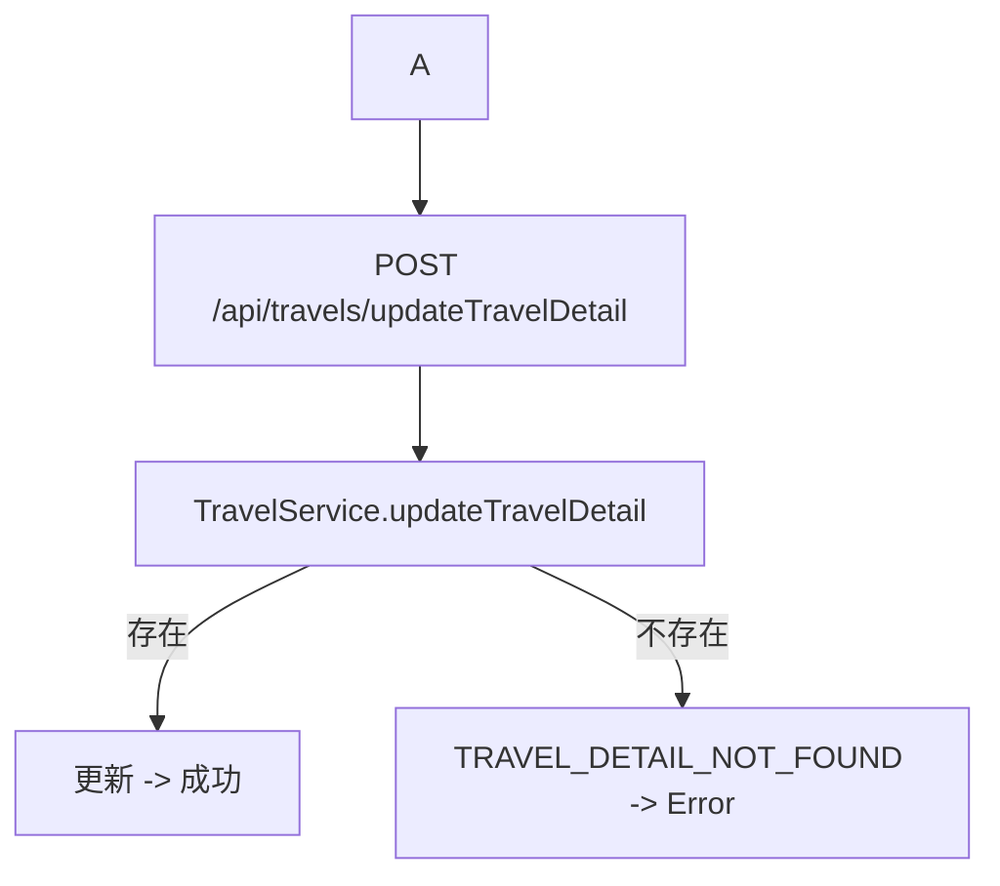
```mermaid
flowchart TD
  A --> B[POST /api/travels/updateTravelDetail]
  B --> C[TravelService.updateTravelDetail]
  C -->|存在| D[更新 -> 成功]
  C -->|不存在| E[TRAVEL_DETAIL_NOT_FOUND -> Error]
```

---

### 12. 調整明細排序 `POST /reorderTravelDetail`
- **目的**：重新排序同日明細。
- **授權**：需要帶入 `Authorization: Bearer <token>`
- **請求範例**
```json
[
  { "id": "detail-1-uuid", "sort": 1 },
  { "id": "detail-2-uuid", "sort": 2 }
]
```
- **欄位說明**
  - `id`（UUID，必填）：行程明細 ID。
  - `sort`（Integer，必填）：排序值，1 起跳。
- **成功回應**：`data` 為 `null`。
- **失敗回應 (範例：TRAVEL_DETAILS_NOT_SAME_TRAVEL)**
```json
{ "data": null, "error": { "code": "TRAVEL_DETAILS_NOT_SAME_TRAVEL", "message": "Details not in the same travel" } }
```
- **流程圖**
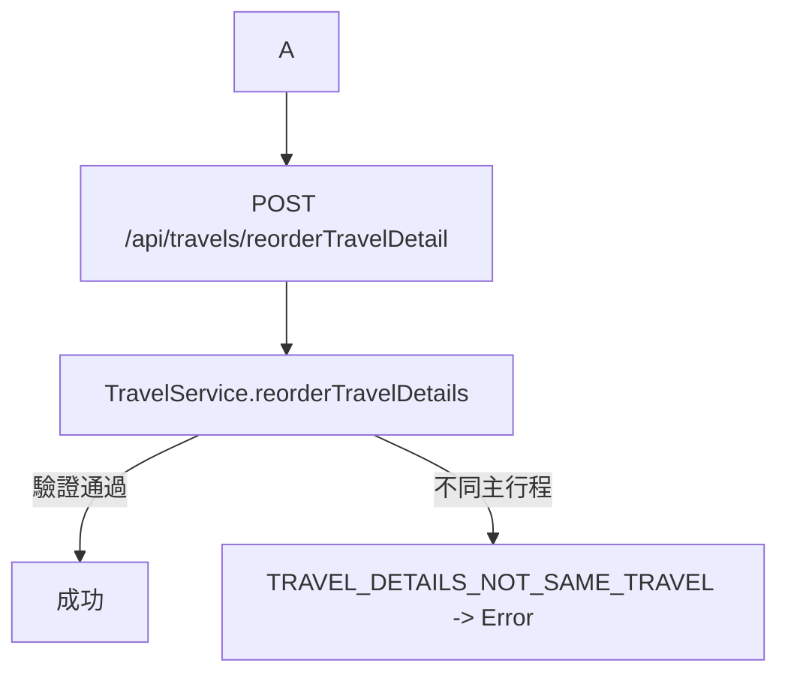
```mermaid
flowchart TD
  A --> B[POST /api/travels/reorderTravelDetail]
  B --> C[TravelService.reorderTravelDetails]
  C -->|驗證通過| D[成功]
  C -->|不同主行程| E[TRAVEL_DETAILS_NOT_SAME_TRAVEL -> Error]
```

---

### 13. 查詢明細 `POST /getTravelDetail`
- **目的**：依 ID 取得單一 `TravelDetail`。
- **請求範例**：`{ "id": "detail-uuid" }`
- **成功回應**：`data` 為 `TravelDetail`。
- **失敗回應**：`TRAVEL_DETAIL_NOT_FOUND`。
- **流程圖**
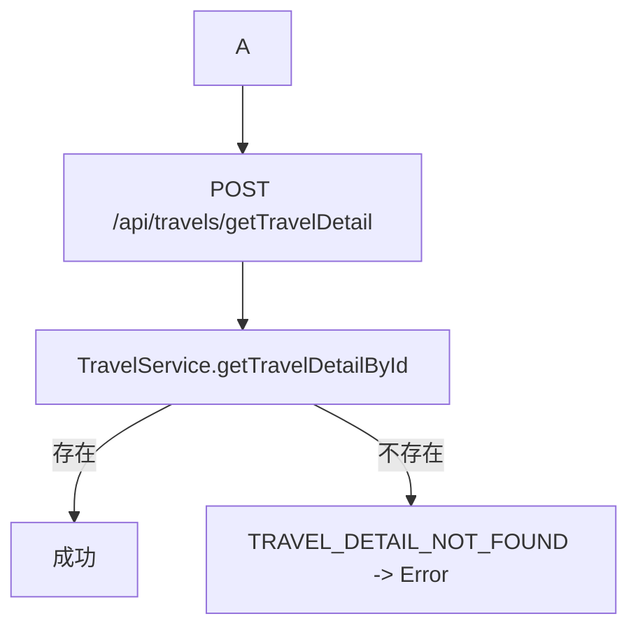
```mermaid
flowchart TD
  A --> B[POST /api/travels/getTravelDetail]
  B --> C[TravelService.getTravelDetailById]
  C -->|存在| D[成功]
  C -->|不存在| E[TRAVEL_DETAIL_NOT_FOUND -> Error]
```

---

### 14. 依日期查詢明細 `POST /getTravelDetailsByTravelDateId`
- **目的**：取得某 `TravelDate` 下的全部明細。
- **請求範例**：`{ "id": "travelDate-uuid" }`
- **成功回應**：`data` 為 `TravelDetail` 陣列。
- **失敗回應**：`TRAVEL_DATE_NOT_FOUND`。
- **流程圖**
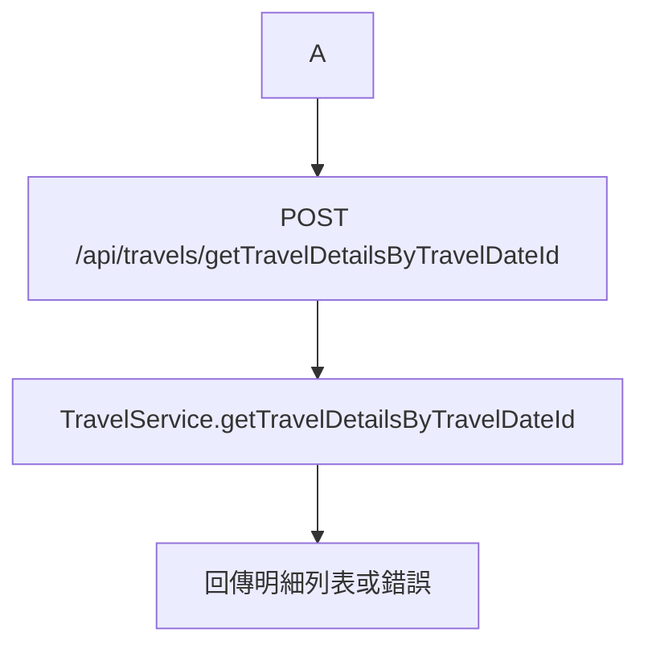
```mermaid
flowchart TD
  A --> B[POST /api/travels/getTravelDetailsByTravelDateId]
  B --> C[TravelService.getTravelDetailsByTravelDateId]
  C --> D[回傳明細列表或錯誤]
```

---

- ### 15. 檢查時間衝突 `POST /checkTimeConflict`
- **目的**：確認明細時間是否與同日其他明細衝突。
- **授權**：需要帶入 `Authorization: Bearer <token>`
- **請求範例**：同 `createTravelDetail` 格式。
- **欄位補充**：
  - 若僅檢查衝突，可省略 `id`（UUID，非必填）；提供 `id` 時代表排除該筆既有明細後進行檢查。
  - `travelDateId`（UUID，必填）需提供，以鎖定同一天的其他明細。
  - `startTime` 與 `endTime`（ISO `HH:mm`，必填）需為有效區間。
- **成功回應**：`data` 為布林值或詳細資訊（Service 回傳結果）。
- **失敗回應 (範例：TRAVEL_DETAIL_INVALID_TIME)**
```json
{ "data": null, "error": { "code": "TRAVEL_DETAIL_INVALID_TIME", "message": "Invalid time range" } }
```
- **流程圖**
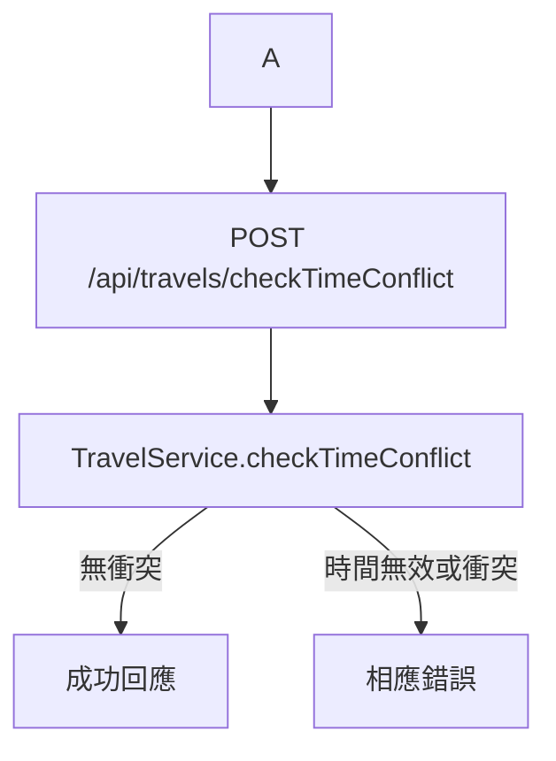
```mermaid
flowchart TD
  A --> B[POST /api/travels/checkTimeConflict]
  B --> C[TravelService.checkTimeConflict]
  C -->|無衝突| D[成功回應]
  C -->|時間無效或衝突| E[相應錯誤]
```

---

- ### 16. 刪除行程明細 `POST /deleteTravelDetail`
- **目的**：刪除單一明細及其相關交通紀錄。
- **授權**：需要帶入 `Authorization: Bearer <token>`
- **請求範例**：`{ "id": "detail-uuid" }`
- **成功回應**：`data` 為 `null`。
- **失敗回應**：`TRAVEL_DETAIL_NOT_FOUND`。
- **流程圖**
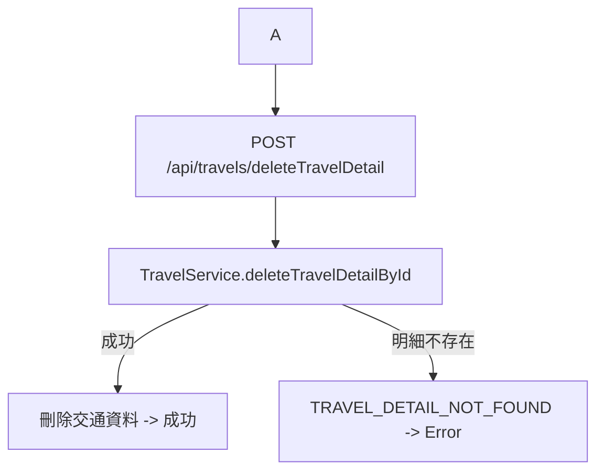
```mermaid
flowchart TD
  A --> B[POST /api/travels/deleteTravelDetail]
  B --> C[TravelService.deleteTravelDetailById]
  C -->|成功| D[刪除交通資料 -> 成功]
  C -->|明細不存在| E[TRAVEL_DETAIL_NOT_FOUND -> Error]
```

---

- ### 17. 行程編輯權限判斷（版本 1） `POST /checkEditPermission`
- **目的**：進入行程編輯頁前判斷是否具備編輯權限，供前端決定是否鎖定編輯功能。
- **版本**：v1（版本 1）
- **授權**：可選。帶入 `Authorization: Bearer <token>` 時依登入會員判斷；未帶入視為訪客。
- **請求範例**
```json
{ "travelMainId": "30c29c31-e9c2-4d0a-81d2-4f2a07123456" }
```
- **欄位說明**
  - `travelMainId`（UUID，必填）：欲檢查的主行程 ID。
- **成功回應範例（創建者或允許者）**
```json
{
  "data": {
    "travelMainId": "30c29c31-e9c2-4d0a-81d2-4f2a07123456",
    "canEdit": true,
    "reason": "ALLOWED",
    "grantedBy": "OWNER"
  },
  "meta": null,
  "error": null
}
```
- **成功回應範例（訪客或未受允許者）**
```json
{
  "data": {
    "travelMainId": "30c29c31-e9c2-4d0a-81d2-4f2a07123456",
    "canEdit": false,
    "reason": "NO_AUTH",
    "grantedBy": "NONE"
  },
  "meta": null,
  "error": null
}
```
- **失敗回應範例（行程不存在）**
```json
{
  "data": null,
  "meta": null,
  "error": {
    "code": "TRAVEL_MAIN_NOT_FOUND",
    "message": "Travel main not found",
    "timestamp": "2024-09-01T00:00:00Z",
    "details": null
  }
}
```
- **備註**：
  - `reason` 用於前端提示，預期值：`NO_AUTH`（未登入）、`ALLOWED`（可編輯）、`NOT_ALLOWED`（已登入但未被允許）。
  - `grantedBy` 表示權限來源：`OWNER`（創建者）、`PERMISSION`（受邀允許）、`NONE`（無權限）。
  - 私有行程仍依創建者或允許者判斷可編輯狀態。

---

- ### 18. 取得人氣行程 `GET /popular`
- **目的**：依據收藏數回傳最多四筆公開人氣行程，支援 Top 與 Threshold 兩種策略。
- **授權**：可選。帶入 `Authorization: Bearer <token>` 時，回應中的 `isFavorited` 會標示該登入會員是否已收藏；未登入一律為 `false`。
- **查詢參數**
  - `strategy`（String，非必填，預設 `top`）：`top` 代表依收藏數高到低取前四筆；`threshold` 代表從收藏數大於等於 `minFavorites` 的候選中隨機取四筆。
  - `minFavorites`（Integer，非必填）：僅在 `strategy=threshold` 時使用，未提供時預設為 `5`，需為 0 或正整數。
- **成功回應範例（攜帶 Token，可辨識收藏狀態）**
```json
{
  "data": [
    {
      "travelMainId": "30c29c31-e9c2-4d0a-81d2-4f2a07123456",
      "title": "東京五日遊",
      "startDate": "2024-09-01",
      "endDate": "2024-09-05",
      "visitPlace": "{\"country\":\"JP\"}",
      "favoritesCount": 18,
      "isPrivate": false,
      "isFavorited": true
    }
  ],
  "meta": {
    "strategy": "threshold",
    "minFavorites": 3,
    "totalCandidates": 5
  },
  "error": null
}
```
- **錯誤回應範例**
  - `POPULAR_STRATEGY_INVALID`：`strategy` 不是 `top` 或 `threshold`。
  - `POPULAR_MIN_FAVORITES_INVALID`：`minFavorites` 為負數。
- **備註**：
  - 當採用 `threshold` 且候選不足四筆時會回退為 `top` 策略，`meta.strategy` 會回報實際採用的策略。
  - 回應以 `RestResponse` 標準格式包裝，`meta.totalCandidates` 表示符合當前策略的候選數量。

---

## TravelFavoriteController (`/api/travelFavorites`)

### 1. 分頁取得收藏行程列表 `POST /list`
- **目的**：以分頁方式取得會員收藏的公開主行程摘要，回傳 `list` + `meta` 結構。
- **授權**：需要帶入 `Authorization: Bearer <token>`
- **請求範例**
```json
{
  "page": 1,
  "size": 10
}
```
- **欄位說明**
  - `page`（Integer，非必填，預設 `1`）：頁碼，需大於等於 1。
  - `size`（Integer，非必填，預設 `10`）：每頁筆數，允許範圍 1~50。
- **成功回應**
```json
{
  "data": {
    "list": [
      {
        "travelMainId": "30c29c31-e9c2-4d0a-81d2-4f2a07123456",
        "title": "台北兩日遊",
        "startDate": "2024-08-01",
        "endDate": "2024-08-02",
        "isPrivate": false,
        "createdAt": "2024-05-20T07:00:00Z",
        "updatedAt": "2024-05-22T07:00:00Z",
        "favoritedAt": "2024-06-01T08:00:00Z",
        "ownerMemberId": "a3d2e7b4-1234-4321-9abc-5678def01234"
      }
    ],
    "meta": {
      "page": 1,
      "size": 10,
      "totalPages": 2,
      "totalElements": 15,
      "hasNext": true,
      "hasPrev": false
    }
  },
  "meta": null,
  "error": null
}
```
- **備註**：
  - 僅回傳仍為公開的收藏行程；若行程改為私人會自動排除。
  - 如未帶入 `page`/`size`，後端會套用預設值。
  - `favoritedAt` 表示收藏時間，預設排序為收藏時間新到舊。

---


## TransController (`/api/trans`)

### 1. 建立/更新交通紀錄 `POST /create`
- **目的**：新增或更新兩個行程明細之間的交通資訊。
- **授權**：需要帶入 `Authorization: Bearer <token>`
- **請求範例**
```json
{
  "id": null,
  "langType": "zh",
  "startDetailId": "detail-start-uuid",
  "endDetailId": "detail-end-uuid",
  "infosRaw": "{\"distance\":\"10km\"}",
  "transType": "CAR",
  "transTime": "00:30",
  "summary": "從A到B約30分鐘",
  "notes": "備註"
}
```
- **欄位說明**
  - `id`（UUID，非必填）：建立時填 `null` 或省略；有值時視為更新既有資料。
  - `langType`（String，必填）：語系代碼，如 `zh`、`en`。
  - `startDetailId`（UUID，必填）：起點明細 ID。
  - `endDetailId`（UUID，必填）：終點明細 ID。
  - `infosRaw`（JSON String，非必填）：交通資訊原始 JSON 字串。
  - `transType`（String，必填）：交通工具類型（如 `CAR`、`WALK`）。
  - `transTime`（ISO `HH:mm`，必填）：交通所需時間。
  - `summary`（String，非必填）：摘要說明。
  - `notes`（String，非必填）：備註內容。
- **成功回應**：`data` 為 `TransI18n`。
- **失敗回應 (範例：TRAVEL_DETAIL_NOT_FOUND / TRAVEL_DETAILS_NOT_SAME_TRAVEL)**
```json
{ "data": null, "error": { "code": "TRAVEL_DETAIL_NOT_FOUND", "message": "Travel detail not found" } }
```
- **流程圖**
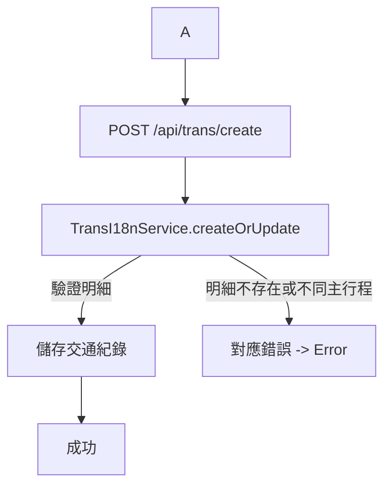
```mermaid
flowchart TD
  A --> B[POST /api/trans/create]
  B --> C[TransI18nService.createOrUpdate]
  C -->|驗證明細| D[儲存交通紀錄]
  D --> E[成功]
  C -->|明細不存在或不同主行程| F[對應錯誤 -> Error]
```

### 2. 刪除交通紀錄 `POST /delete`
- **目的**：依交通紀錄 ID 刪除。
- **授權**：需要帶入 `Authorization: Bearer <token>`
- **請求範例**
```json
{ "id": "trans-uuid" }
```
- **成功回應**：`data` 為 `null`。
- **失敗回應**：若 ID 不存在，仍回傳成功 (JPA delete 無錯誤)。
- **流程圖**
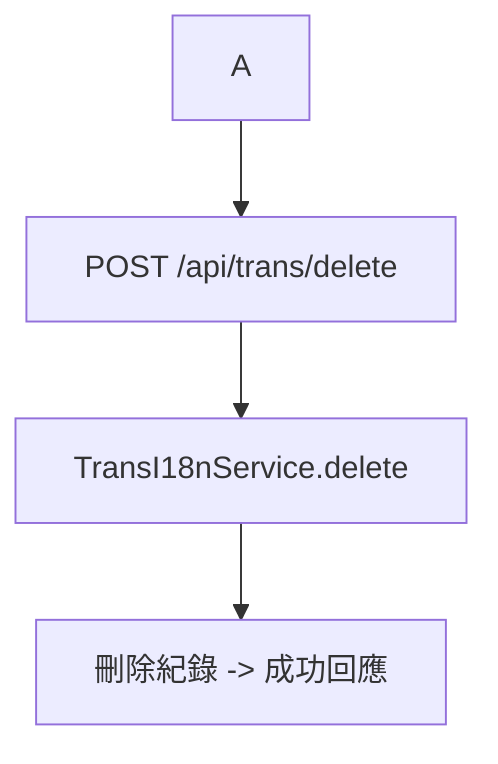
```mermaid
flowchart TD
  A --> B[POST /api/trans/delete]
  B --> C[TransI18nService.delete]
  C --> D[刪除紀錄 -> 成功回應]
```

---

以上為 `TravelController` 與 `TransController` 下所有 POST API 的詳細說明、範例與流程圖。若需整合至專案文件，可直接將本 Markdown 內容納入。
